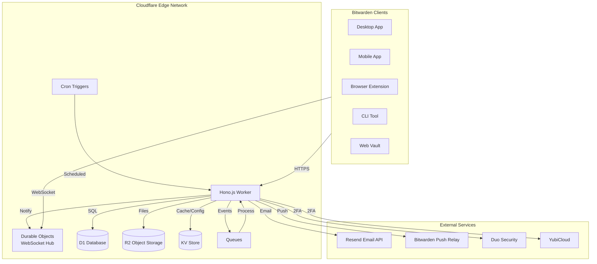
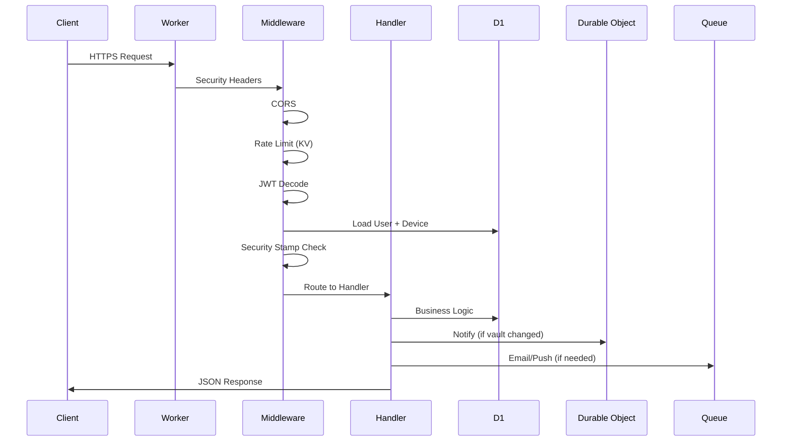
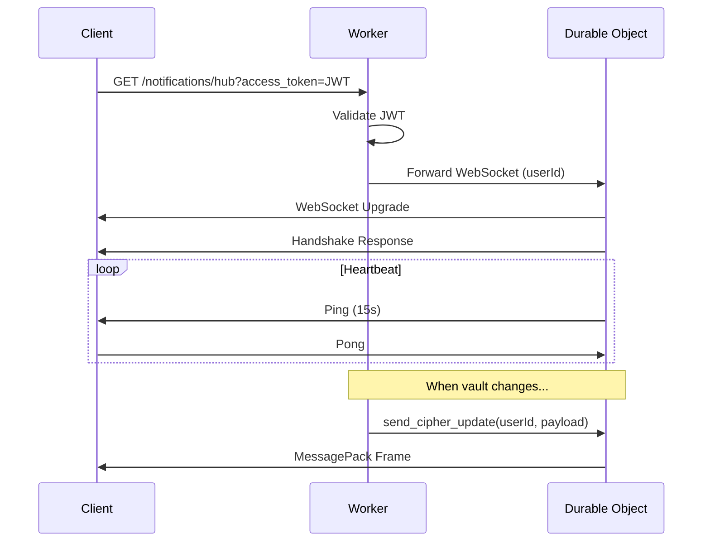
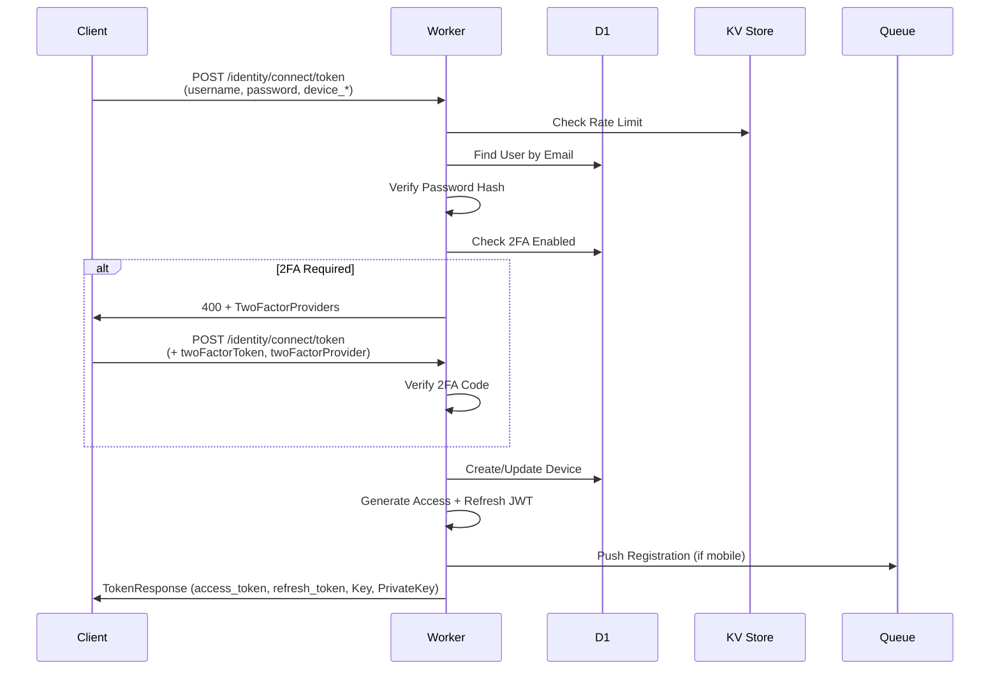
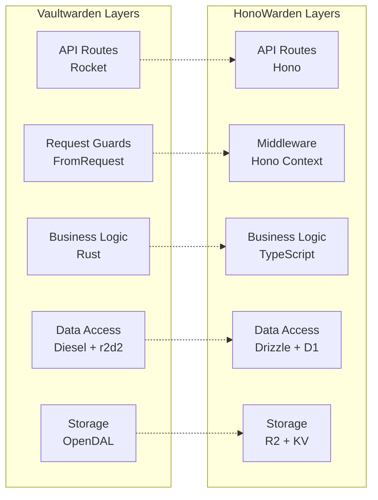

# 系统架构设计

## 整体架构

HonoWarden 采用 Cloudflare 全托管无服务器架构，所有组件运行在 Cloudflare 边缘网络上。



## Cloudflare 服务职责

### Cloudflare Workers (主计算单元)

Workers 承载所有 HTTP 请求处理逻辑，使用 Hono.js 作为路由框架。

**职责：**
- 所有 REST API 端点处理（Identity、Core、Admin、Icons）
- JWT 签发与验证
- 密码哈希校验
- 请求鉴权与权限检查
- 业务逻辑执行
- Cron Trigger 定时任务入口
- Queue 消费者

**约束：**
- 单次请求 CPU 时间上限（Paid: 50ms CPU, Unbound: 30s）
- 无持久化内存（每次请求独立）
- 无长连接（WebSocket 需要 Durable Objects）

### Cloudflare D1 (关系数据库)

D1 是基于 SQLite 的无服务器数据库，通过 Drizzle ORM 进行类型安全操作。

**存储内容：**
- 用户账户（users）
- 密码库条目（ciphers）与关联数据
- 组织、集合、分组
- 设备与会话
- 双因素认证数据
- 策略、事件日志
- Emergency Access
- Send 元数据

**特性：**
- 自动全球读副本
- 内置备份与 Time Travel
- 每秒数千次读取

### Cloudflare R2 (对象存储)

R2 存储所有二进制文件，S3 兼容 API，无出口费用。

**存储内容：**
- 加密的 Cipher 附件
- Send 文件
- 网站图标缓存
- RSA 密钥对

**访问模式：**
- 附件：通过 JWT 签名的下载 URL
- Send 文件：通过 access_id + 密码验证
- 图标：缓存优先，未命中时抓取

### Cloudflare KV (键值存储)

KV 是最终一致的全球分布式键值存储，适合读多写少的场景。

**存储内容：**
- 动态配置覆盖（Admin 面板写入）
- 速率限制计数器
- 图标缓存元数据（命中/未命中标记）
- TOTP 重放防护（last_used 时间戳）

### Cloudflare Durable Objects (实时通信)

Durable Objects 提供单实例强一致性，是 WebSocket 连接管理的核心。

**职责：**
- 维护每用户的 WebSocket 连接池
- 实现 SignalR-style MessagePack 协议
- 广播 Vault 变更事件
- 管理匿名 Auth Request 订阅
- 连接生命周期管理（ping/pong、超时、清理）

**Durable Object 类型：**

| 类名 | ID 策略 | 用途 |
|------|---------|------|
| `UserNotificationHub` | `userId` | 用户已认证 WebSocket 连接 |
| `AnonymousNotificationHub` | `"anonymous"` | 匿名 Auth Request 订阅 |

### Cron Triggers (定时任务)

替代 Vaultwarden 的 `job_scheduler_ng` 线程。

| 任务 | Cron 表达式 | 功能 |
|------|------------|------|
| Send 清理 | `5 * * * *` | 删除过期 Send |
| 回收站清理 | `5 0 * * *` | 删除超期软删 Cipher |
| 2FA 未完成通知 | `*/1 * * * *` | 通知未完成 2FA 的用户 |
| Emergency 超时 | `7 * * * *` | 自动批准超时的紧急访问请求 |
| Emergency 提醒 | `3 * * * *` | 提醒授权人待处理的请求 |
| Auth Request 清理 | `*/1 * * * *` | 清理过期认证请求 |
| 事件清理 | `10 0 * * *` | 删除过期事件日志 |

### Cloudflare Queues (异步任务)

处理不需要同步完成的任务，避免阻塞请求。

| Queue | 用途 |
|-------|------|
| `email-queue` | 邮件发送（注册确认、2FA 码、邀请等） |
| `push-queue` | Push 通知转发到 Bitwarden Relay |
| `event-queue` | 审计事件记录 |

## 请求处理流程

### 标准 API 请求



### WebSocket 连接



### 认证流程



## Worker 入口架构

```typescript
// src/server/index.ts
import { Hono } from "hono";
import { identityRoutes } from "./routes/identity";
import { coreRoutes } from "./routes/core";
import { adminRoutes } from "./routes/admin";
import { iconsRoutes } from "./routes/icons";
import { notificationsRoutes } from "./routes/notifications";
import { webRoutes } from "./routes/web";

const app = new Hono<{ Bindings: Env }>();

// 全局中间件
app.use("*", securityHeaders());
app.use("*", cors());
app.use("*", rateLimiter());

// 路由挂载
app.route("/identity", identityRoutes);
app.route("/api", coreRoutes);
app.route("/admin", adminRoutes);
app.route("/icons", iconsRoutes);
app.route("/notifications", notificationsRoutes);
app.route("/", webRoutes);

export default {
  fetch: app.fetch,
  scheduled: handleCronTrigger,
  queue: handleQueueMessage,
};

// Durable Object 导出
export { UserNotificationHub } from "./durable-objects/user-hub";
export { AnonymousNotificationHub } from "./durable-objects/anonymous-hub";
```

## Bindings 类型定义

```typescript
interface Env {
  // D1
  DB: D1Database;

  // R2
  ATTACHMENTS: R2Bucket;
  SENDS: R2Bucket;
  ICONS: R2Bucket;

  // KV
  CONFIG: KVNamespace;
  RATE_LIMIT: KVNamespace;

  // Durable Objects
  USER_HUB: DurableObjectNamespace;
  ANON_HUB: DurableObjectNamespace;

  // Queues
  EMAIL_QUEUE: Queue;
  PUSH_QUEUE: Queue;
  EVENT_QUEUE: Queue;

  // Secrets
  RSA_PRIVATE_KEY: string;
  ADMIN_TOKEN: string;
  RESEND_API_KEY: string;
  DOMAIN: string;
  DUO_IKEY?: string;
  DUO_SKEY?: string;
  DUO_HOST?: string;
  YUBICO_CLIENT_ID?: string;
  YUBICO_SECRET_KEY?: string;
  PUSH_INSTALLATION_ID?: string;
  PUSH_INSTALLATION_KEY?: string;
}
```

## 与 Vaultwarden 的层级映射


