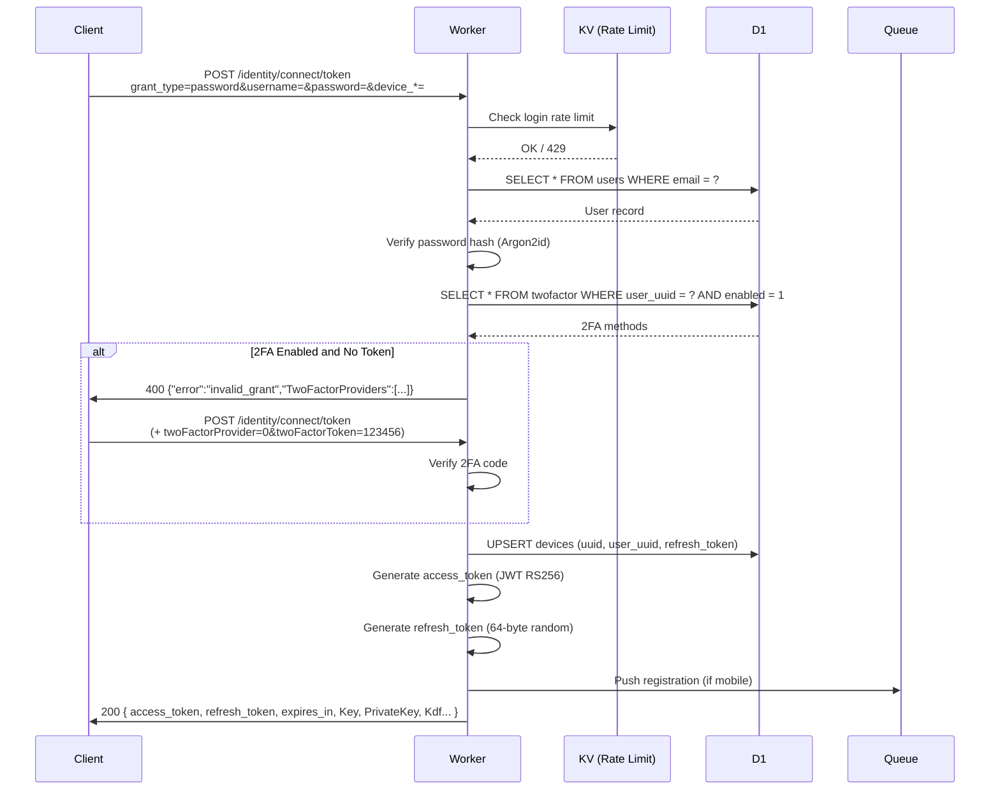
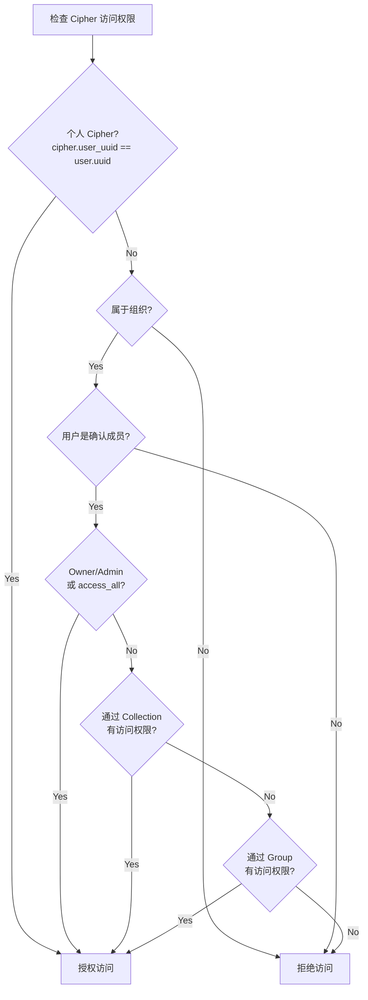

# 认证授权系统设计

## 概述

HonoWarden 实现完整的 Bitwarden 认证协议，包括 JWT RS256 Token、多种 Grant Type、双因素认证、安全戳机制以及基于角色的组织权限控制。

## JWT 体系

### 算法与密钥

- **算法**: RS256 (RSA-SHA256)
- **密钥长度**: 2048-bit RSA
- **库**: `jose` (JOSE 标准库，支持 Workers 运行时)
- **密钥存储**: Workers Secrets (`RSA_PRIVATE_KEY`) 或 R2 持久化

### 密钥初始化

```typescript
// src/server/auth/crypto.ts
import { importPKCS8, importSPKI, exportJWK } from "jose";

let privateKey: CryptoKey;
let publicKey: CryptoKey;

export async function initializeKeys(env: Env) {
  const pemData = env.RSA_PRIVATE_KEY;
  privateKey = await importPKCS8(pemData, "RS256");
  publicKey = await crypto.subtle.importKey(
    "jwk",
    await exportJWK(privateKey),  // extract public from private
    { name: "RSASSA-PKCS1-v1_5", hash: "SHA-256" },
    true,
    ["verify"]
  );
}

export function getPrivateKey() { return privateKey; }
export function getPublicKey() { return publicKey; }
```

### Token 类型

| Token 类型 | Issuer 后缀 | 有效期 | 用途 |
|-----------|-------------|--------|------|
| Login Access | `\|login` | 2 小时 | API 请求认证 |
| Refresh | (存储在 Device.refresh_token) | 30-90 天 | 刷新 Access Token |
| Admin | `\|admin` | 20 分钟 | Admin 面板会话 |
| Invite | `\|invite` | 120 小时 | 组织邀请 |
| Emergency Access Invite | `\|emergencyaccessinvite` | 120 小时 | 紧急访问邀请 |
| Delete Account | `\|delete` | 5 天 | 账户删除确认 |
| Verify Email | `\|verifyemail` | 24 小时 | 邮箱验证 |
| Send Access | `\|send` | 不限 | Send 文件下载 |
| Org API Key | `\|api.organization` | 2 小时 | 组织 API 认证 |
| File Download | `\|file_download` | 5 分钟 | 附件下载 |
| Register Verify | `\|register_verify` | 24 小时 | 注册验证 |

### Token 签发

```typescript
// src/server/auth/jwt.ts
import { SignJWT, jwtVerify } from "jose";
import { getPrivateKey, getPublicKey } from "./crypto";

interface LoginClaims {
  nbf: number;
  exp: number;
  iss: string;
  sub: string;        // user UUID
  premium: boolean;
  name: string;
  email: string;
  email_verified: boolean;
  sstamp: string;      // security stamp
  device: string;      // device UUID
  scope: string[];
  amr: string[];       // auth method references
  orgowner?: string[];
  orgadmin?: string[];
  orguser?: string[];
  orgmanager?: string[];
}

export async function generateLoginToken(
  domain: string,
  user: User,
  device: Device,
  scope: string[],
  now: number
): Promise<string> {
  const claims: LoginClaims = {
    nbf: now,
    exp: now + 7200,   // 2 hours
    iss: `${domain}|login`,
    sub: user.uuid,
    premium: true,
    name: user.name,
    email: user.email,
    email_verified: !!user.verifiedAt,
    sstamp: user.securityStamp,
    device: device.uuid,
    scope,
    amr: ["Application"],
  };

  return new SignJWT(claims as unknown as Record<string, unknown>)
    .setProtectedHeader({ alg: "RS256" })
    .sign(getPrivateKey());
}

export async function generateRefreshToken(): Promise<string> {
  const bytes = new Uint8Array(64);
  crypto.getRandomValues(bytes);
  return btoa(String.fromCharCode(...bytes))
    .replace(/\+/g, "-")
    .replace(/\//g, "_")
    .replace(/=/g, "");
}

export async function verifyToken(token: string, expectedIssuer: string) {
  const { payload } = await jwtVerify(token, getPublicKey(), {
    issuer: expectedIssuer,
    algorithms: ["RS256"],
  });
  return payload;
}
```

## 登录流程

### Grant Type: password



### Grant Type: refresh_token

1. 从 `devices` 表查找 `refresh_token` 匹配的设备
2. 加载关联用户
3. 检查 `security_stamp` 是否与 JWT 中的 `sstamp` 一致
4. 生成新的 `access_token`（refresh_token 不变）
5. 返回 Token Response

### Grant Type: client_credentials

用于组织 API Key 认证：
1. 从 `organization_api_key` 表查找 `client_id` (格式: `organization.{org_uuid}`)
2. 验证 `client_secret` 匹配
3. 签发包含 org 信息的 Token

### Grant Type: authorization_code (SSO)

1. 从 `sso_auth` 表加载 `state` 对应的 PKCE challenge
2. 验证 `code_verifier`
3. 查找或创建 SSO 用户映射
4. 签发标准 Token

## 密码哈希

### 客户端 KDF

客户端使用 PBKDF2-SHA256 或 Argon2id 派生主密钥，然后用 PBKDF2-SHA256 再次哈希生成 `masterPasswordHash` 发送到服务器。

### 服务端验证

```typescript
// src/server/auth/password.ts
// base64ToBuffer 内部调用 normalizeBase64，支持 base64url、去空白、补齐 padding

export async function verifyPassword(
  passwordHash: string,  // 客户端发送的 Base64 编码哈希
  storedHash: ArrayBuffer,
  storedSalt: ArrayBuffer,
  iterations: number
): Promise<boolean> {
  const key = await crypto.subtle.importKey(
    "raw",
    base64ToBuffer(passwordHash),
    "PBKDF2",
    false,
    ["deriveBits"]
  );

  const derived = await crypto.subtle.deriveBits(
    { name: "PBKDF2", salt: storedSalt, iterations, hash: "SHA-256" },
    key,
    256
  );

  return timingSafeEqual(new Uint8Array(derived), new Uint8Array(storedHash));
}

export async function hashPassword(
  passwordHash: string,
  salt: ArrayBuffer,
  iterations: number
): Promise<ArrayBuffer> {
  const key = await crypto.subtle.importKey(
    "raw",
    base64ToBuffer(passwordHash),
    "PBKDF2",
    false,
    ["deriveBits"]
  );

  return crypto.subtle.deriveBits(
    { name: "PBKDF2", salt, iterations, hash: "SHA-256" },
    key,
    256
  );
}
```

## Security Stamp 机制

Security Stamp 是一个 UUID，存储在 `users.security_stamp` 字段中。每次安全敏感操作后重置，使所有现有 Token 失效。

### 触发重置的操作

- 修改主密码
- 修改 KDF 参数
- 修改邮箱
- 密钥轮换
- 手动 Security Stamp 重置
- Admin 面板 Deauth 操作

### 验证流程

每次认证请求时，中间件从 JWT 的 `sstamp` 字段提取安全戳，与数据库中的 `security_stamp` 比较。不匹配则拒绝请求。

### Stamp Exception（宽限期）

某些操作（如密码修改响应）允许 2 分钟的旧 stamp 宽限期：

```typescript
interface StampException {
  route: string;
  security_stamp: string;
  expire: number;  // Unix timestamp
}
```

## 双因素认证 (2FA)

### Provider 类型

| Provider ID | 名称 | 实现方式 |
|------------|------|---------|
| 0 | Authenticator (TOTP) | `otplib` 库，30 秒窗口 |
| 1 | Email | 6 位随机码，通过 Resend 发送 |
| 2 | Duo | Duo OIDC Universal Prompt |
| 3 | YubiKey | YubiCloud OTP 验证 API |
| 5 | Remember | 设备记忆 Token (30 天) |
| 7 | WebAuthn | Web Crypto API + CBOR |

### TOTP 实现

```typescript
// src/server/auth/two-factor/totp.ts
import { authenticator } from "otplib";

export function verifyTotp(token: string, secret: string, lastUsed: number): boolean {
  const now = Math.floor(Date.now() / 1000);
  const currentStep = Math.floor(now / 30);

  // 防重放：拒绝在同一时间步的重复使用
  if (currentStep <= lastUsed) return false;

  return authenticator.verify({ token, secret });
}

export function generateTotpSecret(): string {
  return authenticator.generateSecret();
}

export function generateTotpUri(secret: string, email: string, issuer: string): string {
  return authenticator.keyuri(email, issuer, secret);
}
```

### Email 2FA

```typescript
// src/server/auth/two-factor/email.ts
export async function sendEmailToken(
  env: Env,
  user: User,
  db: Database
): Promise<void> {
  const token = generateNumericCode(6);
  const expiry = Date.now() + 600_000; // 10 minutes

  await db.update(twofactor)
    .set({ data: JSON.stringify({ token, expiry }) })
    .where(and(
      eq(twofactor.userUuid, user.uuid),
      eq(twofactor.atype, TwoFactorType.Email)
    ));

  await env.EMAIL_QUEUE.send({
    type: "two-factor-token",
    to: user.email,
    data: { token, userName: user.name },
  });
}
```

### Recovery Code

启用任何 2FA 方法时自动生成 32 字符恢复码。使用恢复码将禁用所有 2FA 方法。

## Hono 认证中间件

### Auth Middleware（替代 Rocket Request Guards）

```typescript
// src/server/middleware/auth.ts
import { createMiddleware } from "hono/factory";

interface AuthContext {
  user: User;
  device: Device;
  claims: LoginClaims;
}

export const authMiddleware = createMiddleware<{
  Bindings: Env;
  Variables: { auth: AuthContext };
}>(async (c, next) => {
  const authHeader = c.req.header("Authorization");
  if (!authHeader?.startsWith("Bearer ")) {
    return c.json({ error: "Unauthorized" }, 401);
  }

  const token = authHeader.slice(7);
  const domain = new URL(c.req.url).origin;

  try {
    const claims = await verifyToken(token, `${domain}|login`);

    const user = await db.select().from(users)
      .where(eq(users.uuid, claims.sub as string)).get();

    if (!user || !user.enabled) {
      return c.json({ error: "User not found or disabled" }, 401);
    }

    // Security stamp check
    if (user.securityStamp !== claims.sstamp) {
      // Check stamp exception (2-minute grace)
      const exception = user.stampException
        ? JSON.parse(user.stampException) as StampException
        : null;

      if (!exception || exception.expire < Date.now() / 1000
          || exception.security_stamp !== claims.sstamp) {
        return c.json({ error: "Security stamp mismatch" }, 401);
      }
    }

    const device = await db.select().from(devices)
      .where(and(
        eq(devices.uuid, claims.device as string),
        eq(devices.userUuid, user.uuid)
      )).get();

    if (!device) {
      return c.json({ error: "Device not found" }, 401);
    }

    c.set("auth", { user, device, claims: claims as unknown as LoginClaims });
    await next();
  } catch {
    return c.json({ error: "Invalid token" }, 401);
  }
});
```

### 权限守卫中间件

```typescript
// src/server/middleware/guards.ts

// OrgMemberHeaders - 需要确认的组织成员
export const orgMemberGuard = (orgIdParam = "orgId") =>
  createMiddleware<{ Bindings: Env; Variables: { auth: AuthContext; membership: Membership } }>(
    async (c, next) => {
      const orgId = c.req.param(orgIdParam);
      const { user } = c.get("auth");

      const membership = await db.select().from(usersOrganizations)
        .where(and(
          eq(usersOrganizations.userUuid, user.uuid),
          eq(usersOrganizations.orgUuid, orgId),
          eq(usersOrganizations.status, MembershipStatus.Confirmed)
        )).get();

      if (!membership) {
        return c.json({ error: "Not a member" }, 403);
      }

      c.set("membership", membership);
      await next();
    }
  );

// AdminHeaders - 需要 Admin 或 Owner 角色
export const orgAdminGuard = (orgIdParam = "orgId") =>
  createMiddleware(async (c, next) => {
    const membership = c.get("membership");
    if (membership.atype > MembershipType.Admin) {
      return c.json({ error: "Insufficient permissions" }, 403);
    }
    await next();
  });

// OwnerHeaders - 仅 Owner
export const orgOwnerGuard = (orgIdParam = "orgId") =>
  createMiddleware(async (c, next) => {
    const membership = c.get("membership");
    if (membership.atype !== MembershipType.Owner) {
      return c.json({ error: "Owner access required" }, 403);
    }
    await next();
  });

// ManagerHeaders - Manager 及以上
export const orgManagerGuard = (orgIdParam = "orgId") =>
  createMiddleware(async (c, next) => {
    const membership = c.get("membership");
    if (membership.atype > MembershipType.Manager) {
      return c.json({ error: "Manager access required" }, 403);
    }
    await next();
  });

// Admin Panel Guard
export const adminGuard = createMiddleware(async (c, next) => {
  const cookie = c.req.cookie("VW_ADMIN");
  if (!cookie) {
    return c.json({ error: "Admin authentication required" }, 401);
  }

  try {
    const domain = new URL(c.req.url).origin;
    await verifyToken(cookie, `${domain}|admin`);
    await next();
  } catch {
    return c.json({ error: "Invalid admin session" }, 401);
  }
});
```

## 访问控制模型

### Cipher 访问判定



### Collection 权限标志

| 标志 | 含义 |
|------|------|
| `read_only = false` | 可以修改集合中的 Cipher |
| `read_only = true` | 只能查看 |
| `hide_passwords = true` | 隐藏密码字段值 |
| `manage = true` | 可以管理集合本身（添加/移除 Cipher） |

### 写入权限判定

写入权限在读取权限的基础上增加：
- 个人 Cipher：拥有者可写
- 组织 Cipher：Owner/Admin 可写，或通过 Collection（`read_only = false`）
- Manager 角色可管理分配给自己的 Collection
