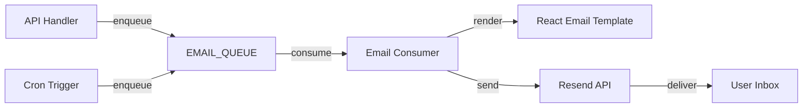
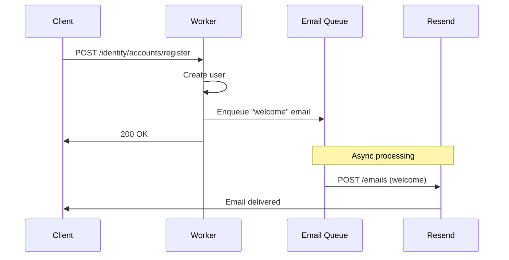
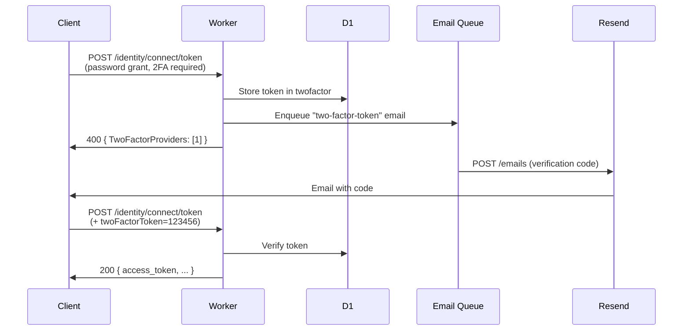

# 邮件系统设计

## 概述

Vaultwarden 使用 SMTP 或 Sendmail 发送邮件，模板使用 Handlebars。HonoWarden 使用 Resend API 替代 SMTP，React Email 替代 Handlebars 模板，邮件发送通过 Queue 异步处理。

## 架构



## Resend 客户端

```typescript
// src/server/email/client.ts
import { Resend } from "resend";

let resendClient: Resend | null = null;

export function getResendClient(env: Env): Resend {
  if (!resendClient) {
    resendClient = new Resend(env.RESEND_API_KEY);
  }
  return resendClient;
}

export interface EmailOptions {
  to: string;
  subject: string;
  html: string;
  text?: string;
}

export async function sendEmail(
  env: Env,
  type: string,
  to: string,
  data: Record<string, unknown>
): Promise<void> {
  const resend = getResendClient(env);
  const fromAddress = await getConfig(env, "smtp_from", "noreply@honowarden.example.com");
  const fromName = await getConfig(env, "smtp_from_name", "HonoWarden");

  const { subject, html, text } = renderEmail(type, data, env);

  await resend.emails.send({
    from: `${fromName} <${fromAddress}>`,
    to,
    subject,
    html,
    text,
  });
}
```

## 邮件模板

### 模板列表

以下列出所有邮件通知类型，对应 Vaultwarden 的 Handlebars 模板：

| 类别 | 模板 ID | 主题 | 触发场景 |
|------|--------|------|---------|
| **账户** | `welcome` | 欢迎使用 HonoWarden | 注册成功 |
| **账户** | `verify-email` | 验证您的邮箱 | 手动请求验证 |
| **账户** | `delete-account` | 确认删除账户 | 请求删除账户 |
| **账户** | `change-email` | 确认邮箱变更 | 邮箱变更请求 |
| **认证** | `password-hint` | 主密码提示 | 请求密码提示 |
| **认证** | `new-device` | 新设备登录通知 | 新设备首次登录 |
| **认证** | `incomplete-2fa` | 未完成的 2FA 登录 | 2FA 验证未完成 |
| **2FA** | `two-factor-token` | 登录验证码 | Email 2FA 登录 |
| **2FA** | `two-factor-setup` | 2FA 设置验证码 | Email 2FA 设置 |
| **2FA** | `two-factor-removed-org` | 2FA 已被移除 | 组织策略移除 2FA |
| **组织** | `org-invite` | 组织邀请 | 邀请加入组织 |
| **组织** | `org-invite-accepted` | 邀请已接受 | 被邀请人接受 |
| **组织** | `org-invite-confirmed` | 成员已确认 | 管理员确认成员 |
| **紧急访问** | `emergency-invite` | 紧急访问邀请 | 邀请紧急联系人 |
| **紧急访问** | `emergency-accepted` | 紧急访问已接受 | 联系人接受邀请 |
| **紧急访问** | `emergency-confirmed` | 紧急访问已确认 | 授权人确认 |
| **紧急访问** | `emergency-initiated` | 恢复请求已发起 | 联系人发起恢复 |
| **紧急访问** | `emergency-approved` | 恢复请求已批准 | 恢复被批准 |
| **紧急访问** | `emergency-rejected` | 恢复请求已拒绝 | 恢复被拒绝 |
| **紧急访问** | `emergency-reminder` | 待处理的恢复请求 | 定时提醒 |
| **紧急访问** | `emergency-timeout` | 恢复已自动批准 | 超时自动批准 |
| **Admin** | `admin-invite` | 邀请注册 | Admin 邀请用户 |
| **Admin** | `admin-reset-password` | 密码已重置 | Admin 重置密码 |
| **Auth Request** | `auth-request` | 登录请求待审批 | 无密码登录请求 |

### React Email 模板示例

```tsx
// src/server/email/templates/two-factor-token.tsx
import {
  Body, Container, Head, Heading, Html, Preview,
  Section, Text, Hr
} from "@react-email/components";

interface TwoFactorTokenProps {
  token: string;
  userName: string;
  ipAddress?: string;
  deviceName?: string;
}

export function TwoFactorTokenEmail({
  token,
  userName,
  ipAddress,
  deviceName,
}: TwoFactorTokenProps) {
  return (
    <Html>
      <Head />
      <Preview>Your verification code: {token}</Preview>
      <Body style={main}>
        <Container style={container}>
          <Heading style={heading}>Login Verification Code</Heading>
          <Text style={text}>Hi {userName},</Text>
          <Text style={text}>Your verification code is:</Text>
          <Section style={codeContainer}>
            <Text style={code}>{token}</Text>
          </Section>
          <Text style={text}>
            This code expires in 10 minutes. If you did not request this code,
            please change your master password immediately.
          </Text>
          {ipAddress && (
            <Text style={meta}>IP Address: {ipAddress}</Text>
          )}
          {deviceName && (
            <Text style={meta}>Device: {deviceName}</Text>
          )}
          <Hr style={hr} />
          <Text style={footer}>
            This is an automated message from HonoWarden.
          </Text>
        </Container>
      </Body>
    </Html>
  );
}

const main = { backgroundColor: "#f6f9fc", fontFamily: "-apple-system, BlinkMacSystemFont, 'Segoe UI', Roboto, sans-serif" };
const container = { backgroundColor: "#ffffff", margin: "0 auto", padding: "40px 20px", maxWidth: "560px" };
const heading = { fontSize: "24px", fontWeight: "bold", color: "#1a1a1a" };
const text = { fontSize: "16px", color: "#4a4a4a", lineHeight: "1.5" };
const codeContainer = { backgroundColor: "#f0f0f0", borderRadius: "8px", padding: "20px", textAlign: "center" as const, margin: "20px 0" };
const code = { fontSize: "32px", fontWeight: "bold", letterSpacing: "4px", color: "#175DDC" };
const meta = { fontSize: "14px", color: "#8a8a8a" };
const hr = { borderColor: "#e6e6e6", margin: "20px 0" };
const footer = { fontSize: "12px", color: "#8a8a8a" };
```

```tsx
// src/server/email/templates/org-invite.tsx
import {
  Body, Button, Container, Head, Heading, Html,
  Preview, Section, Text, Hr
} from "@react-email/components";

interface OrgInviteProps {
  organizationName: string;
  inviterEmail: string;
  acceptUrl: string;
}

export function OrgInviteEmail({
  organizationName,
  inviterEmail,
  acceptUrl,
}: OrgInviteProps) {
  return (
    <Html>
      <Head />
      <Preview>You've been invited to join {organizationName}</Preview>
      <Body style={main}>
        <Container style={container}>
          <Heading style={heading}>Organization Invitation</Heading>
          <Text style={text}>
            {inviterEmail} has invited you to join the organization
            <strong> {organizationName}</strong>.
          </Text>
          <Section style={buttonContainer}>
            <Button style={button} href={acceptUrl}>
              Accept Invitation
            </Button>
          </Section>
          <Text style={text}>
            If you do not wish to join this organization, you can safely ignore
            this email.
          </Text>
          <Hr style={hr} />
          <Text style={footer}>
            This is an automated message from HonoWarden.
          </Text>
        </Container>
      </Body>
    </Html>
  );
}

const main = { backgroundColor: "#f6f9fc", fontFamily: "-apple-system, BlinkMacSystemFont, 'Segoe UI', Roboto, sans-serif" };
const container = { backgroundColor: "#ffffff", margin: "0 auto", padding: "40px 20px", maxWidth: "560px" };
const heading = { fontSize: "24px", fontWeight: "bold", color: "#1a1a1a" };
const text = { fontSize: "16px", color: "#4a4a4a", lineHeight: "1.5" };
const buttonContainer = { textAlign: "center" as const, margin: "30px 0" };
const button = { backgroundColor: "#175DDC", color: "#ffffff", padding: "12px 30px", borderRadius: "6px", fontSize: "16px", fontWeight: "bold", textDecoration: "none" };
const hr = { borderColor: "#e6e6e6", margin: "20px 0" };
const footer = { fontSize: "12px", color: "#8a8a8a" };
```

### 模板渲染

```typescript
// src/server/email/send.ts
import { render } from "@react-email/render";
import { TwoFactorTokenEmail } from "./templates/two-factor-token";
import { OrgInviteEmail } from "./templates/org-invite";
import { WelcomeEmail } from "./templates/welcome";
// ... import all templates

type TemplateMap = {
  "welcome": typeof WelcomeEmail;
  "verify-email": typeof VerifyEmailEmail;
  "two-factor-token": typeof TwoFactorTokenEmail;
  "org-invite": typeof OrgInviteEmail;
  // ... all templates
};

const SUBJECTS: Record<string, string> = {
  "welcome": "Welcome to HonoWarden",
  "verify-email": "Verify your email address",
  "delete-account": "Confirm account deletion",
  "change-email": "Confirm email change",
  "password-hint": "Your master password hint",
  "new-device": "New device login",
  "incomplete-2fa": "Incomplete two-factor login",
  "two-factor-token": "Login verification code",
  "two-factor-setup": "2FA setup verification code",
  "two-factor-removed-org": "Two-factor authentication removed",
  "org-invite": "You've been invited to an organization",
  "org-invite-accepted": "Invitation accepted",
  "org-invite-confirmed": "Membership confirmed",
  "emergency-invite": "Emergency access invitation",
  "emergency-accepted": "Emergency access accepted",
  "emergency-confirmed": "Emergency access confirmed",
  "emergency-initiated": "Emergency access recovery initiated",
  "emergency-approved": "Emergency access recovery approved",
  "emergency-rejected": "Emergency access recovery rejected",
  "emergency-reminder": "Pending emergency access request",
  "emergency-timeout": "Emergency access auto-approved",
  "admin-invite": "You've been invited to HonoWarden",
  "auth-request": "Login request pending approval",
};

export function renderEmail(
  type: string,
  data: Record<string, unknown>,
  env: Env
): { subject: string; html: string; text: string } {
  const subject = SUBJECTS[type] || "HonoWarden Notification";
  const Component = getTemplateComponent(type);
  const element = Component(data as any);

  return {
    subject,
    html: render(element),
    text: render(element, { plainText: true }),
  };
}
```

## 邮件发送集成

### 异步发送模式

所有邮件通过 Queue 异步发送，避免阻塞 API 请求：

```typescript
// 在 API handler 中发送邮件
async function handleRegister(c: Context) {
  // ... create user ...

  // Enqueue welcome email (non-blocking)
  await c.env.EMAIL_QUEUE.send({
    type: "welcome",
    to: user.email,
    data: { userName: user.name, domain: c.env.DOMAIN },
  });

  return c.json(userProfile);
}
```

### 直接发送模式

Admin 测试邮件等场景需要同步发送并返回结果：

```typescript
// POST /admin/test/smtp
async function testEmail(c: Context) {
  const { to } = await c.req.json();

  try {
    await sendEmail(c.env, "welcome", to, {
      userName: "Test User",
      domain: c.env.DOMAIN,
    });
    return c.json({ success: true });
  } catch (error) {
    return c.json({
      success: false,
      error: error instanceof Error ? error.message : "Unknown error",
    }, 500);
  }
}
```

## 邮件发送场景

### 注册流程



### 2FA 验证码



## Resend 配置

### 环境变量

| 变量 | 描述 | 必填 |
|------|------|------|
| `RESEND_API_KEY` | Resend API 密钥 | 是 |
| `MAIL_ENABLED` | 是否启用邮件 (KV) | 否 (默认 true) |
| `SMTP_FROM` | 发件人地址 (KV) | 否 |
| `SMTP_FROM_NAME` | 发件人名称 (KV) | 否 |

### 域名验证

使用 Resend 前需要验证发件域名：

1. 在 Resend Dashboard 添加域名
2. 配置 DNS 记录 (SPF, DKIM, DMARC)
3. 验证完成后即可发送

### 速率限制

Resend 默认限制 2 次/秒。批量发送使用 Resend Batch API：

```typescript
// 批量发送（如组织内通知所有成员）
const resend = getResendClient(env);
await resend.batch.send(
  members.map(m => ({
    from: `${fromName} <${fromAddress}>`,
    to: m.email,
    subject: "Organization Update",
    html: renderHtml(m),
  }))
);
```

### 幂等性

使用 Resend 的幂等性 Key 避免重复发送：

```typescript
await resend.emails.send({
  from: fromAddress,
  to,
  subject,
  html,
  headers: {
    "X-Entity-Ref-ID": `${type}/${userId}/${Date.now()}`,
  },
});
```

## 功能开关

当 `MAIL_ENABLED` 为 `false` 时：
- 不发送任何邮件
- Email 2FA 不可用
- 邀请链接通过 Admin 面板显示
- 注册不需要邮箱验证
