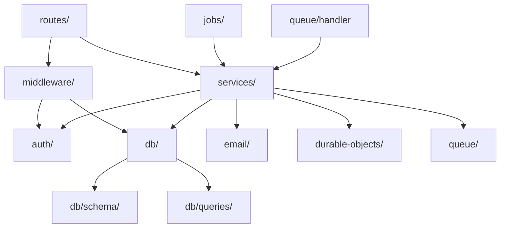

# 项目结构设计

## 顶层目录

```
honowarden/
├── src/
│   ├── server/           # Hono.js API 服务端代码
│   └── client/           # React Admin 面板 + Web Vault
├── test/                 # 测试文件
├── util/                 # 迁移工具、种子数据、初始化脚本
├── scripts/              # 本地开发辅助脚本
├── drizzle/              # Drizzle 迁移文件 (auto-generated)
├── .env                  # 环境变量模板
├── .dev.vars             # 本地开发 Cloudflare 变量
├── wrangler.toml         # Cloudflare Workers 配置
├── drizzle.config.ts     # Drizzle Kit 配置
├── tsconfig.json         # TypeScript 配置
├── vite.config.ts        # Vite 构建配置 (前端)
└── package.json          # 依赖管理
```

## 服务端结构 (`src/server/`)

```
src/server/
├── index.ts                    # Worker 入口，Hono app 创建与导出
├── env.ts                      # Env bindings 类型定义
│
├── routes/                     # API 路由 (对应 Vaultwarden src/api/)
│   ├── identity.ts             # /identity/*, /connect/* - 登录、注册、预认证
│   ├── core/
│   │   ├── index.ts            # 核心路由聚合
│   │   ├── accounts.ts         # /api/accounts/* - 用户账户管理
│   │   ├── ciphers.ts          # /api/ciphers/* - 密码库条目 CRUD
│   │   ├── folders.ts          # /api/folders/* - 文件夹 CRUD
│   │   ├── organizations.ts    # /api/organizations/* - 组织管理
│   │   ├── collections.ts      # /api/organizations/*/collections - 集合管理
│   │   ├── members.ts          # /api/organizations/*/users - 成员管理
│   │   ├── groups.ts           # /api/organizations/*/groups - 分组管理
│   │   ├── policies.ts         # /api/organizations/*/policies - 策略管理
│   │   ├── sends.ts            # /api/sends/* - Bitwarden Send
│   │   ├── two-factor.ts       # /api/two-factor/* - 双因素认证
│   │   ├── emergency-access.ts # /api/emergency-access/* - 紧急访问
│   │   ├── events.ts           # /api/organizations/*/events - 事件日志
│   │   ├── sync.ts             # /api/sync - 全量同步
│   │   └── public.ts           # /api/public/* - Org API Key 认证端点
│   ├── admin.ts                # /admin/* - 管理面板 API
│   ├── icons.ts                # /icons/* - 网站图标服务
│   └── notifications.ts        # /notifications/* - WebSocket 升级入口
│
├── middleware/                  # Hono 中间件 (对应 Vaultwarden Request Guards + Fairings)
│   ├── auth.ts                 # JWT 解码、用户加载、安全戳检查
│   ├── guards.ts               # Headers, AdminHeaders, OwnerHeaders 等权限守卫
│   ├── security-headers.ts     # 安全响应头 (CSP, HSTS, X-Frame-Options)
│   ├── cors.ts                 # CORS 配置
│   ├── rate-limit.ts           # 基于 KV 的速率限制
│   └── error-handler.ts        # 全局错误处理与格式化
│
├── services/                    # 业务逻辑层
│   ├── auth.service.ts          # 认证核心：密码验证、Token 生成、2FA 校验
│   ├── cipher.service.ts        # Cipher CRUD、访问控制、批量操作
│   ├── user.service.ts          # 用户管理：注册、修改、删除
│   ├── organization.service.ts  # 组织管理：创建、成员邀请、权限
│   ├── collection.service.ts    # 集合管理：CRUD、权限映射
│   ├── send.service.ts          # Send 管理：创建、访问、过期清理
│   ├── folder.service.ts        # 文件夹 CRUD
│   ├── attachment.service.ts    # 附件上传/下载、R2 操作
│   ├── emergency.service.ts     # 紧急访问流程管理
│   ├── two-factor.service.ts    # 2FA 各 Provider 的启用/验证
│   ├── icon.service.ts          # 图标抓取、缓存、域名验证
│   ├── event.service.ts         # 事件日志记录
│   ├── push.service.ts          # Bitwarden Push Relay 集成
│   ├── notification.service.ts  # Durable Object 通知分发
│   └── config.service.ts        # 动态配置读写
│
├── db/                          # 数据库层 (对应 Vaultwarden src/db/)
│   ├── schema/                  # Drizzle Schema 定义
│   │   ├── index.ts             # Schema 聚合导出
│   │   ├── users.ts             # users 表
│   │   ├── ciphers.ts           # ciphers + ciphers_collections 表
│   │   ├── folders.ts           # folders + folders_ciphers 表
│   │   ├── organizations.ts     # organizations + users_organizations 表
│   │   ├── collections.ts       # collections + users_collections 表
│   │   ├── groups.ts            # groups + groups_users + collections_groups 表
│   │   ├── devices.ts           # devices 表
│   │   ├── attachments.ts       # attachments 表
│   │   ├── sends.ts             # sends 表
│   │   ├── two-factor.ts        # twofactor + twofactor_incomplete + twofactor_duo_ctx 表
│   │   ├── emergency-access.ts  # emergency_access 表
│   │   ├── org-policies.ts      # org_policies + organization_api_key 表
│   │   ├── events.ts            # event 表
│   │   ├── favorites.ts         # favorites 表
│   │   ├── invitations.ts       # invitations 表
│   │   ├── auth-requests.ts     # auth_requests 表
│   │   └── sso.ts               # sso_auth + sso_users 表
│   ├── queries/                 # 复杂查询封装
│   │   ├── cipher.queries.ts    # Cipher 访问控制查询、批量加载
│   │   ├── collection.queries.ts # 集合权限查询
│   │   ├── org.queries.ts       # 组织成员关系查询
│   │   └── sync.queries.ts      # 全量同步聚合查询
│   ├── client.ts                # Drizzle D1 客户端创建
│   └── migrate.ts               # 迁移执行器
│
├── auth/                        # 认证模块 (对应 Vaultwarden src/auth.rs)
│   ├── jwt.ts                   # JWT 签发与验证 (RS256)
│   ├── tokens.ts                # Token 类型定义 (Login, Refresh, Admin, Invite...)
│   ├── password.ts              # 密码哈希 (Argon2id)
│   ├── crypto.ts                # RSA 密钥管理、加密工具
│   └── two-factor/              # 2FA Providers
│       ├── totp.ts              # TOTP (Authenticator)
│       ├── email.ts             # Email 验证码
│       ├── duo.ts               # Duo Security OIDC
│       ├── yubikey.ts           # YubiKey OTP
│       ├── webauthn.ts          # WebAuthn/FIDO2
│       └── recovery.ts          # 恢复码
│
├── email/                       # 邮件模块 (对应 Vaultwarden src/mail.rs)
│   ├── client.ts                # Resend API 客户端
│   ├── send.ts                  # 邮件发送封装
│   └── templates/               # React Email 模板
│       ├── welcome.tsx
│       ├── verify-email.tsx
│       ├── two-factor-token.tsx
│       ├── invite.tsx
│       ├── password-hint.tsx
│       ├── new-device.tsx
│       ├── emergency-access.tsx
│       └── ...
│
├── durable-objects/             # Durable Objects (对应 Vaultwarden src/api/notifications.rs)
│   ├── user-hub.ts              # UserNotificationHub - 用户 WebSocket
│   └── anonymous-hub.ts         # AnonymousNotificationHub - 匿名订阅
│
├── jobs/                        # Cron 任务处理 (对应 Vaultwarden 的 schedule_jobs)
│   ├── handler.ts               # Cron Trigger 路由分发
│   ├── purge-sends.ts           # 清理过期 Send
│   ├── purge-trash.ts           # 清理回收站
│   ├── purge-auth-requests.ts   # 清理过期认证请求
│   ├── incomplete-2fa.ts        # 未完成 2FA 通知
│   ├── emergency-timeout.ts     # 紧急访问超时处理
│   ├── emergency-reminder.ts    # 紧急访问提醒
│   └── event-cleanup.ts         # 事件日志清理
│
├── queue/                       # Queue 消费者
│   ├── handler.ts               # Queue 消息路由
│   ├── email.consumer.ts        # 邮件队列消费
│   ├── push.consumer.ts         # Push 通知消费
│   └── event.consumer.ts        # 事件记录消费
│
└── utils/                       # 工具函数
    ├── id.ts                    # UUID 生成 (crypto.randomUUID)
    ├── date.ts                  # 日期处理
    ├── validation.ts            # 输入校验
    ├── response.ts              # 统一响应格式
    ├── domain.ts                # 域名验证工具
    └── msgpack.ts               # MessagePack 编解码
```

## 前端结构 (`src/client/`)

> 完整的前端页面设计见 [WebClient.md](WebClient.md)。

```
src/client/
├── main.tsx                        # 入口: ReactDOM + RouterProvider + QueryClientProvider
├── index.css                       # Tailwind + COSS UI 主题
├── router.tsx                      # React Router v7 路由定义
│
├── lib/
│   ├── utils.ts                    # cn() 工具
│   ├── api.ts                      # Fetch wrapper, error handling, token 注入
│   ├── query-client.ts             # TanStack Query 配置
│   └── crypto/
│       ├── keys.ts                 # Master Key / Encryption Key 派生
│       ├── encrypt.ts              # AES-256-CBC 加密
│       ├── decrypt.ts              # AES-256-CBC 解密
│       ├── kdf.ts                  # PBKDF2 / Argon2id
│       ├── rsa.ts                  # RSA-OAEP 操作
│       └── enc-string.ts           # EncString 格式 "2.iv|data|mac"
│
├── stores/
│   ├── auth.store.ts               # Zustand: tokens, user, keys, lock
│   ├── vault.store.ts              # Zustand: 解密后的 vault 缓存
│   └── theme.store.ts              # Zustand: light/dark/system 主题
│
├── hooks/
│   ├── use-media-query.ts          # 响应式断点
│   ├── use-auth.ts                 # login / logout / refresh / lock
│   ├── use-vault.ts                # sync, search, filter, sort
│   ├── use-cipher.ts               # Cipher CRUD + 加解密
│   ├── use-clipboard.ts            # 复制到剪贴板 + 超时清除
│   ├── use-password-generator.ts   # 密码/Passphrase 生成
│   └── use-totp.ts                 # TOTP 倒计时器
│
├── components/
│   ├── ui/                         # COSS UI 组件 (50+)
│   ├── layouts/
│   │   ├── AuthLayout.tsx          # 居中卡片布局
│   │   ├── AdminLayout.tsx         # Admin: 顶部导航 + 内容区
│   │   └── VaultLayout.tsx         # Vault: Sidebar + SidebarInset
│   ├── vault/
│   │   ├── CipherListItem.tsx      # Cipher 列表行
│   │   ├── CipherDetail.tsx        # Cipher 详情面板
│   │   ├── CipherForm.tsx          # 新建/编辑 Cipher
│   │   ├── CipherIcon.tsx          # Cipher 图标
│   │   ├── LoginFields.tsx         # Login 类型字段
│   │   ├── CardFields.tsx          # Card 类型字段
│   │   ├── IdentityFields.tsx      # Identity 类型字段
│   │   ├── CustomFieldsList.tsx    # 自定义字段
│   │   ├── AttachmentsList.tsx     # 附件列表
│   │   ├── PasswordHistory.tsx     # 密码历史
│   │   ├── VaultSidebar.tsx        # Vault Sidebar 组装
│   │   ├── VaultTopBar.tsx         # 顶部栏
│   │   └── VaultSearch.tsx         # 全局搜索 (Command, Ctrl+K)
│   ├── send/
│   │   ├── SendListItem.tsx        # Send 列表项
│   │   ├── SendForm.tsx            # 创建/编辑 Send
│   │   └── SendAccessView.tsx      # Send 公开访问
│   ├── admin/
│   │   ├── UserTable.tsx           # TanStack Table 用户表格
│   │   ├── OrgTable.tsx            # TanStack Table 组织表格
│   │   ├── ConfigForm.tsx          # 配置表单 (Accordion)
│   │   ├── DiagnosticsPanel.tsx    # 诊断检查面板
│   │   ├── InviteUserDialog.tsx    # 邀请用户弹窗
│   │   └── OrgRoleDialog.tsx       # 组织角色修改弹窗
│   └── shared/
│       ├── PasswordInput.tsx       # 密码输入 (visibility toggle)
│       ├── CopyButton.tsx          # 复制按钮 + Toast
│       ├── ConfirmDialog.tsx       # 确认弹窗
│       ├── ThemeToggle.tsx         # 主题切换
│       ├── EmptyState.tsx          # 空状态
│       ├── LoadingScreen.tsx       # 全屏加载
│       ├── ProtectedRoute.tsx      # 认证路由守卫
│       └── AdminRoute.tsx          # Admin 路由守卫
│
├── pages/
│   ├── auth/
│   │   ├── LoginPage.tsx           # 用户登录
│   │   ├── RegisterPage.tsx        # 注册
│   │   ├── TwoFactorPage.tsx       # 2FA 验证
│   │   ├── HintPage.tsx            # 密码提示
│   │   └── RecoverPage.tsx         # 2FA 恢复
│   ├── admin/
│   │   ├── AdminLoginPage.tsx      # Admin 登录
│   │   ├── SettingsPage.tsx        # 配置管理
│   │   ├── UsersPage.tsx           # 用户管理
│   │   ├── OrganizationsPage.tsx   # 组织管理
│   │   └── DiagnosticsPage.tsx     # 系统诊断
│   ├── vault/
│   │   ├── VaultPage.tsx           # 保管库主页 (列表+详情)
│   │   ├── TrashPage.tsx           # 回收站
│   │   └── OrgVaultPage.tsx        # 组织保管库
│   ├── send/
│   │   ├── SendPage.tsx            # Send 管理
│   │   └── SendAccessPage.tsx      # Send 公开访问
│   ├── generator/
│   │   └── GeneratorPage.tsx       # 密码生成器
│   └── settings/
│       ├── AccountPage.tsx         # 账户设置
│       ├── SecurityPage.tsx        # 安全设置
│       ├── TwoFactorSettingsPage.tsx # 2FA 管理
│       ├── EmergencyAccessPage.tsx # 紧急访问
│       ├── DevicesPage.tsx         # 设备管理
│       └── OrganizationsSettingsPage.tsx # 组织管理
│
└── queries/                        # TanStack Query 定义
    ├── auth.queries.ts
    ├── vault.queries.ts
    ├── org.queries.ts
    ├── send.queries.ts
    ├── two-factor.queries.ts
    ├── emergency.queries.ts
    ├── admin.queries.ts
    └── config.queries.ts
```

## 测试结构 (`test/`)

```
test/
├── setup.ts                     # 测试环境配置 (miniflare)
├── helpers/
│   ├── db.ts                    # D1 测试数据库工厂
│   ├── auth.ts                  # 测试用 JWT 生成
│   └── fixtures.ts              # 测试数据夹具
│
├── server/
│   ├── routes/
│   │   ├── identity.test.ts     # Identity API 测试
│   │   ├── accounts.test.ts     # Accounts API 测试
│   │   ├── ciphers.test.ts      # Cipher CRUD 测试
│   │   ├── folders.test.ts      # Folder 测试
│   │   ├── organizations.test.ts # Org 测试
│   │   ├── sends.test.ts        # Send 测试
│   │   ├── two-factor.test.ts   # 2FA 测试
│   │   ├── emergency.test.ts    # Emergency Access 测试
│   │   └── admin.test.ts        # Admin API 测试
│   ├── services/
│   │   ├── auth.test.ts
│   │   ├── cipher.test.ts
│   │   └── ...
│   ├── middleware/
│   │   ├── auth.test.ts
│   │   └── rate-limit.test.ts
│   └── db/
│       ├── queries.test.ts
│       └── schema.test.ts
│
└── client/
    └── pages/
        ├── Settings.test.tsx
        └── Users.test.tsx
```

## 工具与脚本

```
util/
├── seed.ts                      # 种子数据 (开发用)
├── migrate.ts                   # D1 迁移执行
└── import-vaultwarden.ts        # 从 Vaultwarden SQLite 导入数据

scripts/
├── dev.sh                       # 启动本地开发环境
├── generate-keys.ts             # 生成 RSA 密钥对
├── create-admin-token.ts        # 生成 Admin Token (Argon2)
└── test-email.ts                # 测试 Resend 邮件发送
```

## 模块依赖关系



## Vaultwarden 源码对照

| Vaultwarden 文件 | HonoWarden 对应 |
|------------------|-----------------|
| `src/main.rs` | `src/server/index.ts` |
| `src/config.rs` | `src/server/services/config.service.ts` + `src/server/env.ts` |
| `src/auth.rs` | `src/server/auth/jwt.ts` + `src/server/auth/tokens.ts` |
| `src/crypto.rs` | `src/server/auth/crypto.ts` |
| `src/error.rs` | `src/server/middleware/error-handler.ts` |
| `src/mail.rs` | `src/server/email/send.ts` |
| `src/ratelimit.rs` | `src/server/middleware/rate-limit.ts` |
| `src/api/identity.rs` | `src/server/routes/identity.ts` |
| `src/api/admin.rs` | `src/server/routes/admin.ts` |
| `src/api/icons.rs` | `src/server/routes/icons.ts` |
| `src/api/notifications.rs` | `src/server/routes/notifications.ts` + `src/server/durable-objects/` |
| `src/api/push.rs` | `src/server/services/push.service.ts` |
| `src/api/web.rs` | 不再需要 -- Vite + `@cloudflare/vite-plugin` 自动处理静态资源 |
| `src/api/core/accounts.rs` | `src/server/routes/core/accounts.ts` |
| `src/api/core/ciphers.rs` | `src/server/routes/core/ciphers.ts` |
| `src/api/core/folders.rs` | `src/server/routes/core/folders.ts` |
| `src/api/core/organizations.rs` | `src/server/routes/core/organizations.ts` |
| `src/api/core/sends.rs` | `src/server/routes/core/sends.ts` |
| `src/api/core/emergency_access.rs` | `src/server/routes/core/emergency-access.ts` |
| `src/api/core/events.rs` | `src/server/routes/core/events.ts` |
| `src/api/core/two_factor/*.rs` | `src/server/auth/two-factor/` |
| `src/db/schema.rs` | `src/server/db/schema/*.ts` |
| `src/db/models/*.rs` | `src/server/db/schema/*.ts` + `src/server/services/*.ts` |
| `src/db/mod.rs` | `src/server/db/client.ts` |

## 关键依赖

```json
{
  "dependencies": {
    "hono": "^4.x",
    "drizzle-orm": "^0.x",
    "jose": "^5.x",
    "@msgpack/msgpack": "^3.x",
    "argon2": "^0.x",
    "otplib": "^12.x",
    "resend": "^3.x",
    "@react-email/components": "^0.x",
    "react": "^19.x",
    "react-dom": "^19.x"
  },
  "devDependencies": {
    "wrangler": "^3.x",
    "drizzle-kit": "^0.x",
    "vitest": "^2.x",
    "miniflare": "^3.x",
    "@cloudflare/workers-types": "^4.x",
    "typescript": "^5.x",
    "vite": "^6.x",
    "@vitejs/plugin-react": "^4.x"
  }
}
```
