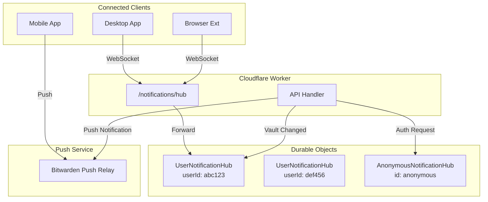

# 实时通信设计

## 概述

HonoWarden 的实时通信系统负责在 Vault 数据变更时即时通知已连接的客户端。原始 Vaultwarden 使用进程内 DashMap + mpsc channel 管理 WebSocket 连接，HonoWarden 使用 Cloudflare Durable Objects 替代，每个用户对应一个独立的 Durable Object 实例。

## 架构



## Durable Object 设计

### UserNotificationHub

每个用户对应一个 `UserNotificationHub` 实例，使用 `userId` 作为 Durable Object ID。管理该用户所有活跃的 WebSocket 连接。

```typescript
// src/server/durable-objects/user-hub.ts
import { DurableObject } from "cloudflare:workers";
import { encode } from "@msgpack/msgpack";

interface NotificationPayload {
  contextId: string;
  type: number;
  payload: Record<string, unknown>;
}

export class UserNotificationHub extends DurableObject {
  private sessions: Map<string, WebSocket> = new Map();

  async fetch(request: Request): Promise<Response> {
    const url = new URL(request.url);

    if (url.pathname === "/websocket") {
      return this.handleWebSocketUpgrade(request);
    }

    if (url.pathname === "/notify" && request.method === "POST") {
      const payload = await request.json() as NotificationPayload;
      this.broadcast(payload);
      return new Response("OK");
    }

    if (url.pathname === "/connections") {
      return Response.json({ count: this.sessions.size });
    }

    return new Response("Not found", { status: 404 });
  }

  private handleWebSocketUpgrade(request: Request): Response {
    const pair = new WebSocketPair();
    const [client, server] = Object.values(pair);

    const sessionId = crypto.randomUUID();
    this.ctx.acceptWebSocket(server);
    this.sessions.set(sessionId, server);

    // Send initial handshake (SignalR-style)
    const handshake = JSON.stringify({ protocol: "messagepack", version: 1 }) + "\x1e";
    server.send(handshake);

    // Start heartbeat using alarm
    this.ctx.storage.setAlarm(Date.now() + 15_000);

    return new Response(null, {
      status: 101,
      webSocket: client,
    });
  }

  async webSocketMessage(ws: WebSocket, message: string | ArrayBuffer): Promise<void> {
    // Handle client pings or SignalR invocations
    if (typeof message === "string" && message.includes('"type":6')) {
      // Ping response - client is alive
      return;
    }
  }

  async webSocketClose(ws: WebSocket, code: number, reason: string): Promise<void> {
    for (const [id, socket] of this.sessions) {
      if (socket === ws) {
        this.sessions.delete(id);
        break;
      }
    }
  }

  async webSocketError(ws: WebSocket, error: unknown): Promise<void> {
    for (const [id, socket] of this.sessions) {
      if (socket === ws) {
        this.sessions.delete(id);
        break;
      }
    }
  }

  async alarm(): Promise<void> {
    // Heartbeat: ping all connections
    const pingFrame = this.encodePingFrame();
    const dead: string[] = [];

    for (const [id, ws] of this.sessions) {
      try {
        ws.send(pingFrame);
      } catch {
        dead.push(id);
      }
    }

    for (const id of dead) {
      this.sessions.delete(id);
    }

    // Schedule next heartbeat if there are active connections
    if (this.sessions.size > 0) {
      this.ctx.storage.setAlarm(Date.now() + 15_000);
    }
  }

  private broadcast(payload: NotificationPayload): void {
    const frame = this.encodeNotificationFrame(payload);
    const dead: string[] = [];

    for (const [id, ws] of this.sessions) {
      try {
        ws.send(frame);
      } catch {
        dead.push(id);
      }
    }

    for (const id of dead) {
      this.sessions.delete(id);
    }
  }

  private encodeNotificationFrame(payload: NotificationPayload): ArrayBuffer {
    // SignalR MessagePack format:
    // [1, {}, null, "ReceiveMessage", [{ContextId, Type, Payload}]]
    const message = [1, {}, null, "ReceiveMessage", [payload]];
    const encoded = encode(message);

    // Length-prefixed: varint length + data
    return this.lengthPrefix(encoded);
  }

  private encodePingFrame(): ArrayBuffer {
    // SignalR ping: [6]
    const encoded = encode([6]);
    return this.lengthPrefix(encoded);
  }

  private lengthPrefix(data: Uint8Array): ArrayBuffer {
    // Variable-length integer encoding for frame size
    const len = data.length;
    const header: number[] = [];
    let remaining = len;

    do {
      let byte = remaining & 0x7f;
      remaining >>= 7;
      if (remaining > 0) byte |= 0x80;
      header.push(byte);
    } while (remaining > 0);

    const result = new Uint8Array(header.length + data.length);
    result.set(header);
    result.set(data, header.length);
    return result.buffer;
  }
}
```

### AnonymousNotificationHub

处理未认证的 Auth Request 订阅（用于无密码登录流程中等待审批）。

```typescript
// src/server/durable-objects/anonymous-hub.ts
import { DurableObject } from "cloudflare:workers";

export class AnonymousNotificationHub extends DurableObject {
  private subscriptions: Map<string, WebSocket> = new Map();

  async fetch(request: Request): Promise<Response> {
    const url = new URL(request.url);

    if (url.pathname === "/websocket") {
      const token = url.searchParams.get("token");
      if (!token) return new Response("Missing token", { status: 400 });
      return this.handleSubscription(request, token);
    }

    if (url.pathname === "/notify" && request.method === "POST") {
      const { token, payload } = await request.json() as {
        token: string;
        payload: Record<string, unknown>;
      };
      this.notifySubscriber(token, payload);
      return new Response("OK");
    }

    return new Response("Not found", { status: 404 });
  }

  private handleSubscription(request: Request, token: string): Response {
    const pair = new WebSocketPair();
    const [client, server] = Object.values(pair);

    this.ctx.acceptWebSocket(server);
    this.subscriptions.set(token, server);

    const handshake = JSON.stringify({ protocol: "messagepack", version: 1 }) + "\x1e";
    server.send(handshake);

    return new Response(null, { status: 101, webSocket: client });
  }

  private notifySubscriber(token: string, payload: Record<string, unknown>): void {
    const ws = this.subscriptions.get(token);
    if (ws) {
      try {
        const message = encode([1, {}, null, "ReceiveMessage", [payload]]);
        ws.send(this.lengthPrefix(message));
      } catch {
        this.subscriptions.delete(token);
      }
    }
  }

  async webSocketClose(ws: WebSocket): Promise<void> {
    for (const [token, socket] of this.subscriptions) {
      if (socket === ws) {
        this.subscriptions.delete(token);
        break;
      }
    }
  }

  // ... lengthPrefix same as UserNotificationHub
}
```

## WebSocket 连接入口

```typescript
// src/server/routes/notifications.ts
import { Hono } from "hono";

const notifications = new Hono<{ Bindings: Env }>();

// 已认证 WebSocket
notifications.get("/hub", async (c) => {
  const accessToken = c.req.query("access_token");
  if (!accessToken) {
    return c.json({ error: "Missing access_token" }, 401);
  }

  // Validate JWT
  const domain = new URL(c.req.url).origin;
  let claims;
  try {
    claims = await verifyToken(accessToken, `${domain}|login`);
  } catch {
    return c.json({ error: "Invalid token" }, 401);
  }

  const userId = claims.sub as string;
  const hubId = c.env.USER_HUB.idFromName(userId);
  const hub = c.env.USER_HUB.get(hubId);

  // Forward WebSocket upgrade to Durable Object
  return hub.fetch(new Request("http://internal/websocket", {
    headers: c.req.raw.headers,
  }));
});

// 匿名 WebSocket (Auth Requests)
notifications.get("/anonymous-hub/:token", async (c) => {
  const token = c.req.param("token");
  const hubId = c.env.ANON_HUB.idFromName("anonymous");
  const hub = c.env.ANON_HUB.get(hubId);

  return hub.fetch(new Request(`http://internal/websocket?token=${token}`, {
    headers: c.req.raw.headers,
  }));
});

export { notifications };
```

## 通知分发服务

```typescript
// src/server/services/notification.service.ts

export type UpdateType =
  | "SyncCipherUpdate" | "SyncCipherCreate" | "SyncCipherDelete"
  | "SyncFolderUpdate" | "SyncFolderCreate" | "SyncFolderDelete"
  | "SyncCiphers" | "SyncVault" | "SyncOrgKeys" | "SyncSettings"
  | "SyncSendUpdate" | "SyncSendCreate" | "SyncSendDelete"
  | "LogOut" | "AuthRequest" | "AuthRequestResponse";

const UpdateTypeMap: Record<UpdateType, number> = {
  SyncCipherUpdate: 0,
  SyncCipherCreate: 1,
  SyncCipherDelete: 2,
  SyncFolderUpdate: 8,
  SyncFolderCreate: 9,
  SyncFolderDelete: 10,
  SyncCiphers: 11,
  SyncVault: 12,
  SyncOrgKeys: 13,
  SyncSettings: 14,
  SyncSendUpdate: 16,
  SyncSendCreate: 17,
  SyncSendDelete: 18,
  LogOut: 15,
  AuthRequest: 19,
  AuthRequestResponse: 20,
};

export async function sendUserNotification(
  env: Env,
  userId: string,
  updateType: UpdateType,
  payload: Record<string, unknown>
): Promise<void> {
  const hubId = env.USER_HUB.idFromName(userId);
  const hub = env.USER_HUB.get(hubId);

  await hub.fetch(new Request("http://internal/notify", {
    method: "POST",
    body: JSON.stringify({
      contextId: crypto.randomUUID(),
      type: UpdateTypeMap[updateType],
      payload,
    }),
  }));
}

export async function sendCipherUpdate(
  env: Env,
  userId: string,
  cipherId: string,
  updateType: "SyncCipherUpdate" | "SyncCipherCreate" | "SyncCipherDelete",
  orgId?: string
): Promise<void> {
  // WebSocket notification
  await sendUserNotification(env, userId, updateType, {
    Id: cipherId,
    UserId: userId,
    OrganizationId: orgId ?? null,
    RevisionDate: new Date().toISOString(),
  });

  // Push notification (mobile)
  await env.PUSH_QUEUE.send({
    type: "cipher_update",
    userId,
    cipherId,
    updateType,
    orgId,
  });

  // If org cipher, notify all org members
  if (orgId) {
    await notifyOrgMembers(env, orgId, updateType, {
      Id: cipherId,
      OrganizationId: orgId,
      RevisionDate: new Date().toISOString(),
    });
  }
}

export async function sendFolderUpdate(
  env: Env,
  userId: string,
  folderId: string,
  updateType: "SyncFolderUpdate" | "SyncFolderCreate" | "SyncFolderDelete"
): Promise<void> {
  await sendUserNotification(env, userId, updateType, {
    Id: folderId,
    UserId: userId,
    RevisionDate: new Date().toISOString(),
  });
}

export async function sendLogout(env: Env, userId: string): Promise<void> {
  await sendUserNotification(env, userId, "LogOut", {});
  await env.PUSH_QUEUE.send({ type: "logout", userId });
}

async function notifyOrgMembers(
  env: Env,
  orgId: string,
  updateType: UpdateType,
  payload: Record<string, unknown>
): Promise<void> {
  const db = createDb(env.DB);
  const members = await db.select({ userUuid: usersOrganizations.userUuid })
    .from(usersOrganizations)
    .where(and(
      eq(usersOrganizations.orgUuid, orgId),
      eq(usersOrganizations.status, MembershipStatus.Confirmed)
    ));

  await Promise.all(
    members.map(m => sendUserNotification(env, m.userUuid, updateType, payload))
  );
}
```

## SignalR MessagePack 协议

Bitwarden 客户端使用 SignalR 协议通过 WebSocket 通信。HonoWarden 必须兼容此协议。

### 握手

连接建立后，服务端发送 JSON 握手（以 `\x1e` 结尾）：

```
{"protocol":"messagepack","version":1}\x1e
```

客户端回复相同格式的握手确认。之后所有消息使用 MessagePack 编码。

### 消息格式

所有 MessagePack 消息都使用长度前缀帧：

```
[varint_length][messagepack_data]
```

### 消息类型

| Type ID | 名称 | 方向 | 用途 |
|---------|------|------|------|
| 1 | Invocation | S->C | 调用客户端方法 |
| 6 | Ping | Both | 心跳 |
| 7 | Close | Both | 关闭连接 |

### 通知消息结构

```
Invocation: [1, {}, null, "ReceiveMessage", [{
  "ContextId": "<uuid>",
  "Type": <UpdateType_number>,
  "Payload": "<base64_encoded_json>"
}]]
```

### UpdateType 值

| 值 | 名称 | 描述 |
|----|------|------|
| 0 | SyncCipherUpdate | Cipher 已更新 |
| 1 | SyncCipherCreate | Cipher 已创建 |
| 2 | SyncCipherDelete | Cipher 已删除 |
| 8 | SyncFolderUpdate | 文件夹已更新 |
| 9 | SyncFolderCreate | 文件夹已创建 |
| 10 | SyncFolderDelete | 文件夹已删除 |
| 11 | SyncCiphers | 需全量同步 Cipher |
| 12 | SyncVault | 需全量同步 Vault |
| 13 | SyncOrgKeys | 组织密钥已更新 |
| 14 | SyncSettings | 设置已更新 |
| 15 | LogOut | 强制登出 |
| 16 | SyncSendUpdate | Send 已更新 |
| 17 | SyncSendCreate | Send 已创建 |
| 18 | SyncSendDelete | Send 已删除 |
| 19 | AuthRequest | 新的认证请求 |
| 20 | AuthRequestResponse | 认证请求已响应 |

## Push 通知集成

移动客户端使用 Bitwarden Push Relay 而非 WebSocket。

```typescript
// src/server/services/push.service.ts

const PUSH_RELAY_URL = "https://push.bitwarden.com";

export async function registerPushDevice(
  env: Env,
  device: Device,
  userId: string
): Promise<void> {
  if (!env.PUSH_INSTALLATION_ID || !env.PUSH_INSTALLATION_KEY) return;

  await fetch(`${PUSH_RELAY_URL}/push/register`, {
    method: "POST",
    headers: {
      "Content-Type": "application/json",
      "Authorization": `Installation ${env.PUSH_INSTALLATION_ID}.${env.PUSH_INSTALLATION_KEY}`,
    },
    body: JSON.stringify({
      pushToken: device.pushToken,
      deviceId: device.pushUuid,
      userId,
    }),
  });
}

export async function sendPushNotification(
  env: Env,
  userId: string,
  type: number,
  payload: Record<string, unknown>
): Promise<void> {
  if (!env.PUSH_INSTALLATION_ID || !env.PUSH_INSTALLATION_KEY) return;

  await fetch(`${PUSH_RELAY_URL}/push/send`, {
    method: "POST",
    headers: {
      "Content-Type": "application/json",
      "Authorization": `Installation ${env.PUSH_INSTALLATION_ID}.${env.PUSH_INSTALLATION_KEY}`,
    },
    body: JSON.stringify({ userId, type, payload }),
  });
}
```

## Durable Objects Hibernation

对于大规模部署，可以使用 Durable Objects 的 WebSocket Hibernation API 来减少资源消耗。当没有活跃消息时，Durable Object 进入休眠状态，仅在收到消息时唤醒：

```typescript
export class UserNotificationHub extends DurableObject {
  async fetch(request: Request): Promise<Response> {
    if (url.pathname === "/websocket") {
      const pair = new WebSocketPair();
      const [client, server] = Object.values(pair);

      // 使用 hibernation API
      this.ctx.acceptWebSocket(server, ["user-session"]);

      const handshake = JSON.stringify({ protocol: "messagepack", version: 1 }) + "\x1e";
      server.send(handshake);

      return new Response(null, { status: 101, webSocket: client });
    }

    if (url.pathname === "/notify") {
      // 广播到所有 hibernated WebSocket
      const sockets = this.ctx.getWebSockets("user-session");
      const payload = await request.json();
      const frame = this.encodeNotificationFrame(payload);

      for (const ws of sockets) {
        try { ws.send(frame); } catch { ws.close(); }
      }
      return new Response("OK");
    }

    return new Response("Not found", { status: 404 });
  }

  async webSocketMessage(ws: WebSocket, message: string | ArrayBuffer): Promise<void> {
    // Handle pings
  }

  async webSocketClose(ws: WebSocket): Promise<void> {
    // Automatic cleanup by runtime
  }
}
```

使用 Hibernation API 的优势：
- Durable Object 在无活跃消息时不计费
- WebSocket 连接由运行时管理，不占用 DO 内存
- 适合大量长连接场景
