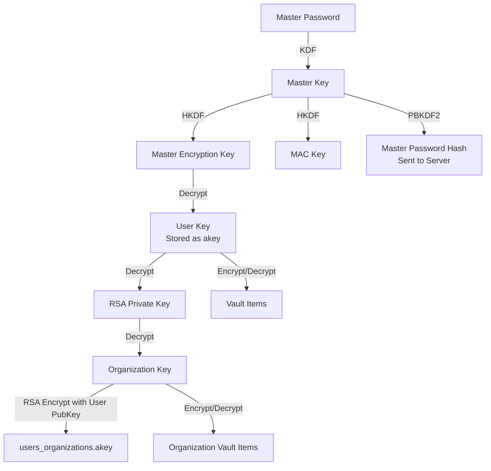

# 安全设计

## 零知识架构

HonoWarden 遵循 Bitwarden 的零知识原则：服务器永远无法访问用户的明文密码、明文 Vault 数据或加密密钥。

### 核心原则

1. **主密码永不离开客户端** - 客户端使用 KDF 派生密钥后才发送哈希到服务器
2. **所有 Vault 数据客户端加密** - name, notes, fields, login 等字段在服务器端始终是密文
3. **服务器无法解密** - 加密密钥由主密码派生，服务器不持有主密码
4. **端到端加密** - 组织共享通过 RSA 非对称加密传递组织密钥

### 密钥层级



### 服务器存储的数据

| 数据 | 格式 | 可否解密 |
|------|------|---------|
| Master Password Hash | Argon2id/PBKDF2 哈希 | 不可 |
| User Key (akey) | 加密的对称密钥 | 不可（需主密码） |
| Private Key | 加密的 RSA 私钥 | 不可（需 User Key） |
| Public Key | 明文 RSA 公钥 | 无需解密 |
| Cipher 数据 | 加密 JSON | 不可 |
| 附件 | 加密二进制 | 不可 |
| Send 数据 | 加密 JSON/文件 | 不可 |

## 传输安全

### HTTPS

Cloudflare 自动提供全球 HTTPS，包括：
- 自动 TLS 证书
- TLS 1.2/1.3
- HTTP/2 和 HTTP/3 (QUIC)
- 自动 HTTP -> HTTPS 重定向

### 安全响应头

```typescript
// src/server/middleware/security-headers.ts
import { createMiddleware } from "hono/factory";

export const securityHeaders = () =>
  createMiddleware(async (c, next) => {
    await next();

    c.header("Strict-Transport-Security", "max-age=31536000; includeSubDomains");
    c.header("X-Content-Type-Options", "nosniff");
    c.header("X-Frame-Options", "SAMEORIGIN");
    c.header("X-XSS-Protection", "0");
    c.header("Referrer-Policy", "same-origin");
    c.header("Content-Security-Policy",
      "default-src 'self'; " +
      "script-src 'self' 'wasm-unsafe-eval'; " +
      "style-src 'self' 'unsafe-inline'; " +
      "img-src 'self' data: https://haveibeenpwned.com; " +
      "connect-src 'self' wss: https://haveibeenpwned.com; " +
      "frame-ancestors 'self'; " +
      "form-action 'self'"
    );
    c.header("Permissions-Policy",
      "accelerometer=(), camera=(), geolocation=(), gyroscope=(), " +
      "magnetometer=(), microphone=(), payment=(), usb=()"
    );
  });
```

## CORS 配置

```typescript
// src/server/middleware/cors.ts
import { cors } from "hono/cors";

export const corsMiddleware = (domain: string) =>
  cors({
    origin: domain,
    allowMethods: ["GET", "POST", "PUT", "DELETE", "OPTIONS"],
    allowHeaders: [
      "Authorization",
      "Content-Type",
      "Accept",
      "Device-Type",
      "Bitwarden-Client-Name",
      "Bitwarden-Client-Version",
    ],
    exposeHeaders: [],
    credentials: true,
    maxAge: 86400,
  });
```

## 速率限制

### 实现方案

基于 Cloudflare KV 的滑动窗口速率限制：

```typescript
// src/server/middleware/rate-limit.ts
import { createMiddleware } from "hono/factory";

interface RateLimitConfig {
  maxRequests: number;
  windowSeconds: number;
  keyPrefix: string;
}

export const rateLimiter = (config?: Partial<RateLimitConfig>) =>
  createMiddleware<{ Bindings: Env }>(async (c, next) => {
    const ip = c.req.header("CF-Connecting-IP") || "unknown";
    const path = new URL(c.req.url).pathname;

    const limitConfig = getRouteRateLimit(path, config);
    if (!limitConfig) {
      await next();
      return;
    }

    const key = `rate:${ip}:${limitConfig.keyPrefix}`;
    const current = await c.env.RATE_LIMIT.get(key);
    const count = current ? parseInt(current, 10) : 0;

    if (count >= limitConfig.maxRequests) {
      return c.json({
        error: "Too many requests",
        error_description: "Rate limit exceeded. Try again later.",
      }, 429);
    }

    await c.env.RATE_LIMIT.put(key, String(count + 1), {
      expirationTtl: limitConfig.windowSeconds,
    });

    c.header("X-RateLimit-Limit", String(limitConfig.maxRequests));
    c.header("X-RateLimit-Remaining", String(limitConfig.maxRequests - count - 1));

    await next();
  });

function getRouteRateLimit(
  path: string,
  override?: Partial<RateLimitConfig>
): RateLimitConfig | null {
  if (override) {
    return {
      maxRequests: override.maxRequests || 10,
      windowSeconds: override.windowSeconds || 60,
      keyPrefix: override.keyPrefix || "default",
    };
  }

  // Route-specific limits
  if (path.startsWith("/identity/connect/token")) {
    return { maxRequests: 10, windowSeconds: 60, keyPrefix: "login" };
  }
  if (path.startsWith("/identity/accounts/register")) {
    return { maxRequests: 3, windowSeconds: 3600, keyPrefix: "register" };
  }
  if (path.includes("/two-factor/send-email")) {
    return { maxRequests: 5, windowSeconds: 300, keyPrefix: "2fa-email" };
  }
  if (path.startsWith("/admin") && path !== "/admin/logout") {
    return { maxRequests: 10, windowSeconds: 300, keyPrefix: "admin" };
  }
  if (path.includes("password-hint")) {
    return { maxRequests: 3, windowSeconds: 3600, keyPrefix: "hint" };
  }
  if (path.includes("/sends/access/")) {
    return { maxRequests: 30, windowSeconds: 60, keyPrefix: "send-access" };
  }

  return null; // No rate limit for this route
}
```

### 限制策略汇总

| 端点 | 限制 | 窗口 | 理由 |
|------|------|------|------|
| 登录 | 10 次/IP | 60s | 防暴力破解 |
| 注册 | 3 次/IP | 1h | 防批量注册 |
| 2FA Email | 5 次/IP | 5min | 防验证码轰炸 |
| Admin 登录 | 10 次/IP | 5min | 防暴力破解 |
| 密码提示 | 3 次/IP | 1h | 防信息泄露 |
| Send 访问 | 30 次/IP | 60s | 防暴力猜测 |

## 输入验证

### 参数化查询

Drizzle ORM 的所有查询自动使用参数化，防止 SQL 注入：

```typescript
// Drizzle 自动参数化
const user = await db.select().from(users)
  .where(eq(users.email, userInput))  // userInput 自动转义
  .get();
```

### 输入校验

```typescript
// src/server/utils/validation.ts

export function validateEmail(email: string): boolean {
  return /^[^\s@]+@[^\s@]+\.[^\s@]+$/.test(email) && email.length <= 254;
}

export function validateUuid(id: string): boolean {
  return /^[0-9a-f]{8}-[0-9a-f]{4}-[0-9a-f]{4}-[0-9a-f]{4}-[0-9a-f]{12}$/i.test(id);
}

export function validateDomain(domain: string): boolean {
  if (!domain || domain.length > 255) return false;
  if (domain.startsWith(".") || domain.startsWith("-")) return false;
  if (domain.includes("..")) return false;
  return /^[a-zA-Z0-9][a-zA-Z0-9.-]*[a-zA-Z0-9]$/.test(domain);
}

export function sanitizeString(input: string, maxLength: number = 10000): string {
  return input.slice(0, maxLength).replace(/[<>&"']/g, (c) => {
    switch (c) {
      case "<": return "&lt;";
      case ">": return "&gt;";
      case "&": return "&amp;";
      case '"': return "&quot;";
      case "'": return "&#39;";
      default: return c;
    }
  });
}
```

## 密码安全

### Admin Token

Admin Token 推荐使用 Argon2id PHC 格式：

```bash
# 生成 Argon2 哈希
npx wrangler secret put ADMIN_TOKEN
# 输入: $argon2id$v=19$m=65540,t=3,p=4$...
```

验证逻辑：

```typescript
// src/server/auth/password.ts
export async function verifyAdminToken(input: string, stored: string): Promise<boolean> {
  if (stored.startsWith("$argon2")) {
    return verifyArgon2(input, stored);
  }
  // Plain text comparison (not recommended)
  return timingSafeEqual(
    new TextEncoder().encode(input),
    new TextEncoder().encode(stored)
  );
}
```

### 时序安全比较

所有密码和 Token 比较使用恒定时间比较，防止时序攻击：

```typescript
export function timingSafeEqual(a: Uint8Array, b: Uint8Array): boolean {
  if (a.length !== b.length) return false;
  let result = 0;
  for (let i = 0; i < a.length; i++) {
    result |= a[i] ^ b[i];
  }
  return result === 0;
}
```

## 图标服务安全

### 域名校验

```typescript
function isBlockedDomain(domain: string): boolean {
  // Block private/internal addresses
  const blocked = [
    /^localhost$/i,
    /^127\.\d+\.\d+\.\d+$/,
    /^10\.\d+\.\d+\.\d+$/,
    /^172\.(1[6-9]|2\d|3[01])\.\d+\.\d+$/,
    /^192\.168\.\d+\.\d+$/,
    /^0\.0\.0\.0$/,
    /^::1$/,
    /^fc00:/i,
    /^fe80:/i,
    /\.local$/i,
    /\.internal$/i,
  ];

  return blocked.some(pattern => pattern.test(domain));
}
```

### 内容检查

下载的图标必须通过 magic number 检查：

```typescript
const VALID_MAGIC: [string, number[]][] = [
  ["image/png", [0x89, 0x50, 0x4E, 0x47]],
  ["image/jpeg", [0xFF, 0xD8, 0xFF]],
  ["image/gif", [0x47, 0x49, 0x46]],
  ["image/webp", [0x52, 0x49, 0x46, 0x46]],
  ["image/x-icon", [0x00, 0x00, 0x01, 0x00]],
  ["image/bmp", [0x42, 0x4D]],
];

function validateIconContent(data: ArrayBuffer): boolean {
  const bytes = new Uint8Array(data);
  return VALID_MAGIC.some(([, magic]) =>
    magic.every((byte, i) => bytes[i] === byte)
  );
}
```

## 错误处理

### 安全错误响应

错误信息不暴露内部实现细节：

```typescript
// src/server/middleware/error-handler.ts
export const errorHandler = createMiddleware(async (c, next) => {
  try {
    await next();
  } catch (error) {
    console.error("Unhandled error:", error);

    // Never expose internal errors to client
    if (error instanceof AppError) {
      return c.json({
        error: error.code,
        error_description: error.message,
      }, error.status);
    }

    return c.json({
      error: "server_error",
      error_description: "An unexpected error occurred.",
    }, 500);
  }
});

export class AppError extends Error {
  constructor(
    public readonly status: number,
    public readonly code: string,
    message: string
  ) {
    super(message);
  }
}
```

### 日志安全

```typescript
// 安全日志 - 永远不记录敏感数据
function logAuthAttempt(email: string, success: boolean, ip: string): void {
  console.log(JSON.stringify({
    event: "auth_attempt",
    email: maskEmail(email),     // us****@example.com
    success,
    ip: maskIp(ip),              // 192.168.1.***
    timestamp: new Date().toISOString(),
  }));
}

function maskEmail(email: string): string {
  const [local, domain] = email.split("@");
  return `${local.slice(0, 2)}${"*".repeat(Math.max(local.length - 2, 2))}@${domain}`;
}

function maskIp(ip: string): string {
  const parts = ip.split(".");
  if (parts.length === 4) {
    return `${parts[0]}.${parts[1]}.${parts[2]}.***`;
  }
  return "***";
}
```

## TOTP 重放防护

同一个 TOTP 码在同一时间步内不能重复使用：

```typescript
async function checkTotpReplay(
  env: Env,
  userId: string,
  timeStep: number
): Promise<boolean> {
  const key = `totp:used:${userId}:${timeStep}`;
  const used = await env.CONFIG.get(key);
  if (used) return true;  // Already used

  await env.CONFIG.put(key, "1", { expirationTtl: 90 });
  return false;
}
```

## Cloudflare 平台安全

HonoWarden 继承 Cloudflare 平台的安全特性：

| 特性 | 描述 |
|------|------|
| DDoS 防护 | 自动 L3/L4/L7 DDoS 缓解 |
| WAF | Web 应用防火墙（可选启用规则） |
| Bot Management | 机器人检测与管理 |
| SSL/TLS | 全球自动 HTTPS |
| IP 隔离 | Workers 间网络隔离 |
| 沙箱 | V8 Isolate 沙箱执行 |
| 审计日志 | Cloudflare Dashboard 操作审计 |

## 合规性考量

| 要求 | HonoWarden 实现 |
|------|-----------------|
| 数据加密 (at rest) | D1 SQLite 加密, R2 server-side encryption |
| 数据加密 (in transit) | Cloudflare TLS 1.2/1.3 |
| 数据加密 (in use) | Vault 数据始终加密，服务器无法解密 |
| 访问控制 | JWT + RBAC + Collection permissions |
| 审计日志 | Event 表记录所有敏感操作 |
| 数据驻留 | D1 location hint, R2 region selection |
| 数据删除 | 账户删除级联清理所有关联数据 |
| 密码策略 | 组织级 MasterPassword policy |
