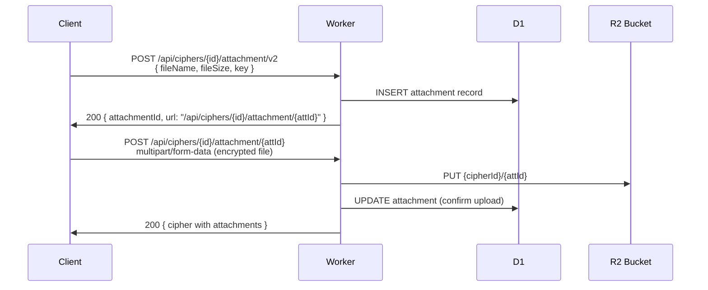

# 存储方案设计

## 概述

HonoWarden 使用三种 Cloudflare 存储服务，各自承担不同的数据职责：

| 存储 | 用途 | 特性 |
|------|------|------|
| **D1** | 所有结构化数据 | SQL, 强一致, 全球读副本 |
| **R2** | 二进制文件 | S3 兼容, 无出口费, 大文件 |
| **KV** | 缓存与元数据 | 最终一致, 全球低延迟, 读多写少 |

## 存储内容映射

### Vaultwarden -> HonoWarden 存储映射

| Vaultwarden PathType | 存储内容 | HonoWarden 存储 | Binding |
|---------------------|---------|-----------------|---------|
| Data | 主数据目录 | D1 + R2 | `DB`, `ATTACHMENTS` |
| Attachments | Cipher 附件 | R2 | `ATTACHMENTS` |
| Sends | Send 文件 | R2 | `SENDS` |
| IconCache | 网站图标 | R2 + KV | `ICONS`, `CONFIG` |
| RsaKey | RSA 密钥对 | Workers Secrets | `RSA_PRIVATE_KEY` |
| TmpFolder | 临时文件 | (不需要) | - |
| Templates | 邮件模板 | 代码内置 (React Email) | - |

---

## R2 对象存储

### Bucket 设计

使用三个独立的 R2 Bucket 实现职责分离：

| Bucket | Binding | 内容 | 访问模式 |
|--------|---------|------|---------|
| `honowarden-attachments` | `ATTACHMENTS` | Cipher 加密附件 | JWT 签名 URL |
| `honowarden-sends` | `SENDS` | Send 文件 | access_id + password |
| `honowarden-icons` | `ICONS` | 网站图标缓存 | 公开读 (缓存) |

### 附件存储

**Key 格式**: `{cipher_uuid}/{attachment_id}`

**上传流程**:



**下载流程**:

```typescript
// src/server/services/attachment.service.ts
export async function getAttachmentDownloadUrl(
  env: Env,
  cipherId: string,
  attachmentId: string,
  userId: string
): Promise<string> {
  // Generate short-lived JWT for file download
  const token = await generateFileDownloadToken(env, cipherId, attachmentId);
  const domain = env.DOMAIN;
  return `${domain}/api/attachments/${cipherId}/${attachmentId}?token=${token}`;
}

export async function downloadAttachment(
  env: Env,
  cipherId: string,
  attachmentId: string
): Promise<R2ObjectBody | null> {
  return env.ATTACHMENTS.get(`${cipherId}/${attachmentId}`);
}

export async function uploadAttachment(
  env: Env,
  cipherId: string,
  attachmentId: string,
  data: ReadableStream,
  contentLength: number
): Promise<void> {
  await env.ATTACHMENTS.put(`${cipherId}/${attachmentId}`, data, {
    httpMetadata: { contentType: "application/octet-stream" },
    customMetadata: { cipherId, attachmentId, size: String(contentLength) },
  });
}

export async function deleteAttachment(
  env: Env,
  cipherId: string,
  attachmentId: string
): Promise<void> {
  await env.ATTACHMENTS.delete(`${cipherId}/${attachmentId}`);
}
```

### Send 文件存储

**Key 格式**: `{send_uuid}/{file_id}`

```typescript
// src/server/services/send.service.ts (file operations)
export async function uploadSendFile(
  env: Env,
  sendId: string,
  fileId: string,
  data: ReadableStream
): Promise<void> {
  await env.SENDS.put(`${sendId}/${fileId}`, data, {
    httpMetadata: { contentType: "application/octet-stream" },
  });
}

export async function downloadSendFile(
  env: Env,
  sendId: string,
  fileId: string
): Promise<R2ObjectBody | null> {
  return env.SENDS.get(`${sendId}/${fileId}`);
}

export async function deleteSendFiles(env: Env, sendId: string): Promise<void> {
  const objects = await env.SENDS.list({ prefix: `${sendId}/` });
  if (objects.objects.length > 0) {
    await env.SENDS.delete(objects.objects.map(o => o.key));
  }
}
```

### 图标缓存

**Key 格式**: `icons/{domain}/icon.png` 或 `icons/{domain}/.miss`

```typescript
// src/server/services/icon.service.ts
const ICON_CACHE_TTL = 30 * 24 * 3600;      // 30 days positive cache
const ICON_NEG_CACHE_TTL = 3 * 24 * 3600;   // 3 days negative cache

export async function getIcon(env: Env, domain: string): Promise<Response> {
  // 1. Validate domain
  if (!isValidDomain(domain)) {
    return new Response(null, { status: 404 });
  }

  // 2. Check R2 cache
  const cacheKey = `icons/${domain}/icon.png`;
  const cached = await env.ICONS.get(cacheKey);

  if (cached) {
    return new Response(cached.body, {
      headers: {
        "Content-Type": cached.httpMetadata?.contentType || "image/png",
        "Cache-Control": `public, max-age=${ICON_CACHE_TTL}`,
      },
    });
  }

  // 3. Check negative cache in KV
  const miss = await env.CONFIG.get(`icon:miss:${domain}`);
  if (miss) {
    return new Response(null, { status: 404 });
  }

  // 4. Fetch icon from website
  try {
    const iconData = await fetchIcon(domain);

    if (iconData) {
      await env.ICONS.put(cacheKey, iconData.data, {
        httpMetadata: { contentType: iconData.contentType },
      });
      return new Response(iconData.data, {
        headers: {
          "Content-Type": iconData.contentType,
          "Cache-Control": `public, max-age=${ICON_CACHE_TTL}`,
        },
      });
    }
  } catch {
    // Fall through to negative cache
  }

  // 5. Store negative cache
  await env.CONFIG.put(`icon:miss:${domain}`, "1", {
    expirationTtl: ICON_NEG_CACHE_TTL,
  });

  return new Response(null, { status: 404 });
}

async function fetchIcon(domain: string): Promise<{ data: ArrayBuffer; contentType: string } | null> {
  // Try favicon.ico first
  const urls = [
    `https://${domain}/favicon.ico`,
    `https://${domain}/favicon.png`,
  ];

  // Try HTML parsing for <link rel="icon">
  try {
    const html = await fetch(`https://${domain}`, {
      headers: { "User-Agent": "Mozilla/5.0" },
      redirect: "follow",
    });
    const text = await html.text();
    const iconUrl = parseIconFromHtml(text, domain);
    if (iconUrl) urls.unshift(iconUrl);
  } catch {
    // Ignore HTML fetch errors
  }

  for (const url of urls) {
    try {
      const response = await fetch(url, {
        headers: { "User-Agent": "Mozilla/5.0" },
        redirect: "follow",
      });
      if (response.ok) {
        const contentType = response.headers.get("content-type") || "image/x-icon";
        if (isValidIconContentType(contentType)) {
          return { data: await response.arrayBuffer(), contentType };
        }
      }
    } catch {
      continue;
    }
  }

  return null;
}
```

---

## KV 存储

### Namespace 设计

| Namespace | Binding | 内容 | TTL |
|-----------|---------|------|-----|
| `honowarden-config` | `CONFIG` | 动态配置、图标缓存标记 | 可变 |
| `honowarden-rate-limit` | `RATE_LIMIT` | 速率限制计数器 | 60-3600s |

### KV 使用场景

#### 1. 动态配置

Admin 面板写入的配置覆盖存储在 KV 中：

```typescript
// Key: config:{setting_name}
// Value: JSON string of the setting value
await env.CONFIG.put("config:signups_allowed", "false");
await env.CONFIG.put("config:smtp_host", '"smtp.example.com"');

// 读取
const value = await env.CONFIG.get("config:signups_allowed");
```

#### 2. 速率限制

```typescript
// Key: rate:{ip}:{action}
// Value: request count
// TTL: window size

export async function checkRateLimit(
  kv: KVNamespace,
  key: string,
  maxRequests: number,
  windowSeconds: number
): Promise<boolean> {
  const current = await kv.get(key);
  const count = current ? parseInt(current, 10) : 0;

  if (count >= maxRequests) return false;

  await kv.put(key, String(count + 1), {
    expirationTtl: windowSeconds,
  });
  return true;
}
```

**限制策略**:

| 操作 | Key 模式 | 限制 | 窗口 |
|------|---------|------|------|
| 登录 | `rate:{ip}:login` | 10 次 | 60s |
| 注册 | `rate:{ip}:register` | 3 次 | 3600s |
| 2FA 验证码 | `rate:{ip}:2fa` | 5 次 | 300s |
| Admin 登录 | `rate:{ip}:admin` | 5 次 | 300s |
| 密码提示 | `rate:{ip}:hint` | 3 次 | 3600s |

#### 3. 图标缓存标记

```typescript
// Key: icon:miss:{domain}
// Value: "1"
// TTL: 3 days
```

#### 4. TOTP 重放防护

```typescript
// Key: totp:used:{user_uuid}:{time_step}
// Value: "1"
// TTL: 90s (覆盖 3 个 30s 窗口)
await env.CONFIG.put(`totp:used:${userId}:${timeStep}`, "1", {
  expirationTtl: 90,
});
```

---

## D1 数据库

详细 Schema 见 [DatabaseSchema.md](DatabaseSchema.md)。

### 读写分离

D1 支持全球读副本（Read Replication），写入操作路由到主实例，读取操作可以从最近的副本读取。

```typescript
// 对于需要强一致读的操作（如登录后立即读取），使用 consistency: "strong"
const user = await db.select().from(users)
  .where(eq(users.email, email))
  .get();

// 默认读取即可利用全球副本
```

### 事务支持

D1 支持事务，用于需要原子性的多步操作：

```typescript
// Cipher 共享到组织（多表操作需事务）
await db.batch([
  db.update(ciphers)
    .set({ organizationUuid: orgId, userUuid: null })
    .where(eq(ciphers.uuid, cipherId)),
  db.insert(ciphersCollections)
    .values(collectionIds.map(colId => ({
      cipherUuid: cipherId,
      collectionUuid: colId,
    }))),
]);
```

### 备份策略

D1 内置 Time Travel 功能，支持：
- 自动备份（最多 30 天）
- 指定时间点恢复
- 通过 REST API 或 wrangler 管理

---

## RSA 密钥存储

RSA 私钥是 JWT 签名的核心，存储方式：

### 方案 1: Workers Secrets（推荐）

```bash
# 生成密钥
openssl genrsa -out rsa_key.pem 2048

# 存储为 Secret
npx wrangler secret put RSA_PRIVATE_KEY < rsa_key.pem
```

在 Worker 中通过 `env.RSA_PRIVATE_KEY` 访问。

### 方案 2: R2 存储

适合需要动态轮换密钥的场景：

```typescript
async function loadRsaKey(env: Env): Promise<string> {
  const obj = await env.ATTACHMENTS.get("_system/rsa_key.pem");
  if (obj) return await obj.text();

  // Generate new key
  const keyPair = await crypto.subtle.generateKey(
    { name: "RSASSA-PKCS1-v1_5", modulusLength: 2048, publicExponent: new Uint8Array([1, 0, 1]), hash: "SHA-256" },
    true,
    ["sign", "verify"]
  );

  const exported = await crypto.subtle.exportKey("pkcs8", keyPair.privateKey);
  const pem = arrayBufferToPem(exported, "PRIVATE KEY");

  await env.ATTACHMENTS.put("_system/rsa_key.pem", pem);
  return pem;
}
```

---

## 文件清理

### 删除 Cipher 时清理附件

```typescript
export async function deleteCipherWithAttachments(
  env: Env,
  db: Database,
  cipherId: string
): Promise<void> {
  // 1. Get all attachments
  const atts = await db.select()
    .from(attachments)
    .where(eq(attachments.cipherUuid, cipherId));

  // 2. Delete from R2
  if (atts.length > 0) {
    await env.ATTACHMENTS.delete(
      atts.map(a => `${cipherId}/${a.id}`)
    );
  }

  // 3. Delete from D1 (cascade)
  await db.delete(attachments).where(eq(attachments.cipherUuid, cipherId));
  await db.delete(ciphersCollections).where(eq(ciphersCollections.cipherUuid, cipherId));
  await db.delete(foldersCiphers).where(eq(foldersCiphers.cipherUuid, cipherId));
  await db.delete(favorites).where(eq(favorites.cipherUuid, cipherId));
  await db.delete(ciphers).where(eq(ciphers.uuid, cipherId));
}
```

### 过期 Send 清理

由 Cron Trigger 定时执行，详见 [BackgroundJobs.md](BackgroundJobs.md)。

---

## 存储限制

| 服务 | 限制 | 影响 |
|------|------|------|
| D1 单数据库 | 10 GB (Free), 无限 (Paid) | 用户数、Cipher 数量 |
| D1 单行 | 1 MB | Cipher data 字段大小 |
| D1 批量操作 | 100 条语句 | 批量导入需分批 |
| R2 单对象 | 5 TB | 附件大小上限（实际限制更小） |
| R2 单次上传 | 5 GB (multipart) | 大附件需分片 |
| KV 单值 | 25 MB | 配置值大小 |
| KV 写入频率 | 1 次/秒/Key | 速率限制精度 |
| Worker 请求体 | 100 MB (Paid) | 附件上传上限 |
