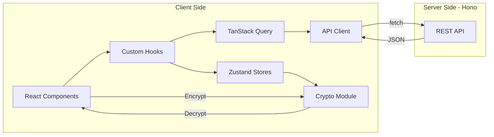
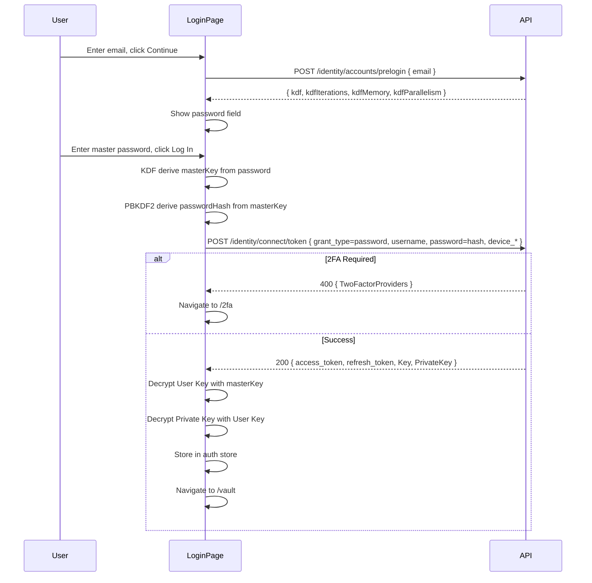
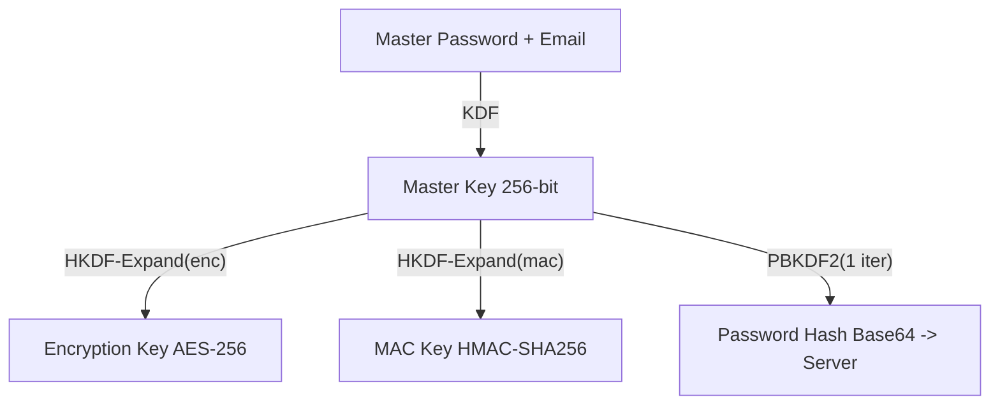

# Web Client 页面设计

## 概述

HonoWarden Web Client 统一在 `src/client/` 目录下，使用 React 19 + COSS UI 重新实现 Vaultwarden 的两个前端：

1. **Admin 面板** -- 替代原 Bootstrap + Handlebars + jQuery/DataTables 的 5 个管理页面
2. **个人保管库 (Web Vault)** -- 替代原 Bitwarden 官方 Angular Web Vault，提供完整的密码管理 UI

## 技术选型

### 已有依赖 (来自 NewProject/honowarden)

| 库 | 版本 | 用途 |
|----|------|------|
| react | 19.2.x | UI 框架 |
| react-dom | 19.2.x | DOM 渲染 |
| vite | 6.x | 构建工具 |
| tailwindcss | 4.x | CSS 工具类 |
| @tailwindcss/vite | 4.x | Vite 集成 |
| @cloudflare/vite-plugin | 1.x | Workers 全栈集成 |
| @base-ui/react | 1.x | COSS UI 底层 |
| class-variance-authority | 0.7.x | 变体样式 |
| lucide-react | 0.577.x | 图标库 |
| hono | 4.x | 后端框架 |

### 需要新增的依赖

| 库 | 用途 | 选型理由 |
|----|------|---------|
| `react-router` v7 | 客户端路由 | React 生态最成熟方案，支持 SPA 模式，类型安全 |
| `@tanstack/react-query` v5 | 服务端状态管理 | 自动缓存、失效、重试、乐观更新 |
| `@tanstack/react-table` v8 | 数据表格 | Headless 设计，配合 COSS UI Table 组件 |
| `react-hook-form` | 表单管理 | 高性能非受控表单，减少重渲染 |
| `zod` | Schema 验证 | TypeScript-first，与 react-hook-form 深度集成 |
| `@hookform/resolvers` | 验证桥接 | 连接 zod 和 react-hook-form |
| `zustand` | 客户端状态 | 轻量级，无 boilerplate，持久化插件 |
| `argon2-browser` | Argon2id KDF | WASM 实现，客户端密钥派生 |
| `qrcode.react` | QR 码生成 | TOTP 2FA 设置时展示 |
| `@tanstack/react-virtual` | 虚拟滚动 | Cipher 列表大量条目的渲染性能 |

### 已有 COSS UI 组件

项目已包含 50+ COSS UI 组件，关键使用映射：

| COSS UI 组件 | 使用场景 |
|-------------|---------|
| `Sidebar` + 全套子组件 | Vault 左侧导航 |
| `Table` | Admin 用户/组织表格 |
| `Dialog` / `AlertDialog` | 编辑/确认弹窗 |
| `Sheet` | Cipher 编辑面板 |
| `Form` / `Field` / `Fieldset` | 所有表单 |
| `Input` / `Textarea` / `Select` | 表单输入 |
| `Switch` / `Checkbox` | 开关/多选 |
| `NumberField` | 数字输入 |
| `Button` | 按钮 |
| `Badge` | 状态标签 |
| `Avatar` | 用户/组织头像 |
| `Tabs` | 页签切换 |
| `Accordion` / `Collapsible` | 折叠面板 |
| `Menu` | 操作菜单 |
| `Command` | 全局搜索 (Ctrl+K) |
| `Toast` | 操作反馈通知 |
| `Popover` / `Tooltip` | 悬浮信息 |
| `Pagination` | 分页控件 |
| `Slider` | 密码长度滑块 |
| `Meter` / `Progress` | 密码强度指示 |
| `Calendar` | 日期选择 |
| `Separator` | 分割线 |
| `Skeleton` | 加载占位 |
| `Spinner` | 加载指示器 |
| `Breadcrumb` | 面包屑导航 |
| `Scroll Area` | 自定义滚动区 |
| `Kbd` | 快捷键提示 |
| `Empty` | 空状态 |
| `Card` | 卡片容器 |
| `Alert` | 提示/警告 |
| `Radio Group` | 单选组 |
| `Toggle` / `Toggle Group` | 切换按钮 |
| `Toolbar` | 工具栏 |
| `Input Group` | 输入组合 |

---

## 整体架构

```mermaid
graph TD
    subgraph routing [React Router v7]
        Root["/"] --> AuthLayout
        Root --> AdminLayout
        Root --> VaultLayout
    end

    subgraph auth [Auth Pages - AuthLayout]
        AuthLayout --> Login["/login"]
        AuthLayout --> Register["/register"]
        AuthLayout --> TwoFactor["/2fa"]
        AuthLayout --> Hint["/hint"]
        AuthLayout --> Recover["/recover-2fa"]
    end

    subgraph admin [Admin Panel - AdminLayout]
        AdminLayout --> ALogin["/admin/login"]
        AdminLayout --> ASettings["/admin/settings"]
        AdminLayout --> AUsers["/admin/users"]
        AdminLayout --> AOrgs["/admin/organizations"]
        AdminLayout --> ADiag["/admin/diagnostics"]
    end

    subgraph vault [Personal Vault - VaultLayout]
        VaultLayout --> AllItems["/vault"]
        VaultLayout --> Favorites["/vault/favorites"]
        VaultLayout --> Trash["/vault/trash"]
        VaultLayout --> Folders["/vault/folders/:id"]
        VaultLayout --> OrgVault["/vault/org/:orgId"]
        VaultLayout --> Send["/send"]
        VaultLayout --> Generator["/generator"]
        VaultLayout --> Settings["/settings/*"]
    end
```



### 数据流架构



---

## 路由定义

```typescript
// src/client/router.tsx
import { createBrowserRouter, Navigate } from "react-router";
import { AuthLayout } from "./components/layouts/AuthLayout";
import { AdminLayout } from "./components/layouts/AdminLayout";
import { VaultLayout } from "./components/layouts/VaultLayout";

export const router = createBrowserRouter([
  // Root redirect
  { path: "/", element: <RootRedirect /> },

  // Auth routes (no auth required)
  {
    element: <AuthLayout />,
    children: [
      { path: "/login", element: <LoginPage /> },
      { path: "/register", element: <RegisterPage /> },
      { path: "/2fa", element: <TwoFactorPage /> },
      { path: "/hint", element: <HintPage /> },
      { path: "/recover-2fa", element: <RecoverPage /> },
      { path: "/sso", element: <SSOCallbackPage /> },
    ],
  },

  // Send public access (no auth required)
  { path: "/send/:accessId", element: <SendAccessPage /> },

  // Admin routes (admin auth required)
  { path: "/admin/login", element: <AuthLayout><AdminLoginPage /></AuthLayout> },
  {
    path: "/admin",
    element: <AdminLayout />,
    children: [
      { index: true, element: <Navigate to="/admin/settings" replace /> },
      { path: "settings", element: <SettingsPage /> },
      { path: "users", element: <UsersPage /> },
      { path: "organizations", element: <OrganizationsPage /> },
      { path: "diagnostics", element: <DiagnosticsPage /> },
    ],
  },

  // Vault routes (user auth required)
  {
    element: <VaultLayout />,
    children: [
      { path: "/vault", element: <VaultPage /> },
      { path: "/vault/favorites", element: <VaultPage filter="favorites" /> },
      { path: "/vault/trash", element: <TrashPage /> },
      { path: "/vault/folders/:folderId", element: <VaultPage /> },
      { path: "/vault/type/:typeId", element: <VaultPage /> },
      { path: "/vault/org/:orgId", element: <OrgVaultPage /> },
      { path: "/vault/org/:orgId/col/:colId", element: <OrgVaultPage /> },
      { path: "/send", element: <SendPage /> },
      { path: "/generator", element: <GeneratorPage /> },
      {
        path: "/settings",
        children: [
          { index: true, element: <AccountPage /> },
          { path: "security", element: <SecurityPage /> },
          { path: "two-factor", element: <TwoFactorSettingsPage /> },
          { path: "emergency-access", element: <EmergencyAccessPage /> },
          { path: "devices", element: <DevicesPage /> },
          { path: "organizations", element: <OrganizationsSettingsPage /> },
        ],
      },
    ],
  },
]);
```

---

## 文件结构

```
src/client/
├── main.tsx                        # 入口: ReactDOM + RouterProvider + QueryClientProvider
├── index.css                       # Tailwind + COSS UI 主题 (已有)
├── router.tsx                      # 路由表定义
│
├── lib/
│   ├── utils.ts                    # cn() 工具 (已有)
│   ├── api.ts                      # Fetch wrapper, error handling, token 自动注入
│   ├── query-client.ts             # TanStack Query 客户端配置
│   └── crypto/
│       ├── keys.ts                 # Master Key / Encryption Key / MAC Key 派生
│       ├── encrypt.ts              # AES-256-CBC 加密 (EncString format)
│       ├── decrypt.ts              # AES-256-CBC 解密
│       ├── kdf.ts                  # PBKDF2-SHA256 / Argon2id
│       ├── rsa.ts                  # RSA-OAEP 加解密 (组织密钥交换)
│       └── enc-string.ts           # EncString 格式解析 "2.iv|data|mac"
│
├── stores/
│   ├── auth.store.ts               # 认证状态: tokens, user profile, device info, lock
│   ├── vault.store.ts              # 解密后的 vault 缓存: ciphers, folders, collections
│   └── theme.store.ts              # 主题偏好: light / dark / system
│
├── hooks/
│   ├── use-media-query.ts          # 响应式断点 (已有)
│   ├── use-auth.ts                 # login / logout / refresh / lock 逻辑
│   ├── use-vault.ts                # sync, search, filter, sort ciphers
│   ├── use-cipher.ts               # 单个 cipher CRUD + 加解密
│   ├── use-clipboard.ts            # 复制到剪贴板, 超时自动清除
│   ├── use-password-generator.ts   # 密码/Passphrase 生成算法
│   └── use-totp.ts                 # TOTP 倒计时器
│
├── components/
│   ├── ui/                         # COSS UI 组件 (已有, 50+ 组件)
│   │
│   ├── layouts/
│   │   ├── AuthLayout.tsx          # 居中卡片布局 (登录/注册共用)
│   │   ├── AdminLayout.tsx         # Admin: 顶部导航 + 主内容区
│   │   └── VaultLayout.tsx         # Vault: Sidebar + SidebarInset
│   │
│   ├── vault/
│   │   ├── CipherListItem.tsx      # Cipher 列表行: 图标 + 名称 + 副标题 + 收藏
│   │   ├── CipherDetail.tsx        # Cipher 详情面板 (按类型渲染字段)
│   │   ├── CipherForm.tsx          # 新建/编辑 Cipher 表单 (Sheet)
│   │   ├── CipherIcon.tsx          # Cipher 图标: favicon / 类型图标
│   │   ├── LoginFields.tsx         # Login 类型字段: URI, Username, Password, TOTP
│   │   ├── CardFields.tsx          # Card 类型字段: Number, Expiry, CVV
│   │   ├── IdentityFields.tsx      # Identity 类型字段: 姓名, 地址, 联系方式
│   │   ├── SecureNoteView.tsx      # SecureNote 渲染
│   │   ├── SshKeyFields.tsx        # SSH Key 类型字段
│   │   ├── CustomFieldsList.tsx    # 自定义字段列表
│   │   ├── AttachmentsList.tsx     # 附件列表 (上传/下载/删除)
│   │   ├── PasswordHistory.tsx     # 密码历史面板
│   │   ├── FolderTree.tsx          # 文件夹树状导航 (Sidebar)
│   │   ├── OrgTree.tsx             # 组织 + 集合树 (Sidebar)
│   │   ├── VaultSidebar.tsx        # Vault Sidebar 完整组装
│   │   ├── VaultTopBar.tsx         # 顶部栏: 搜索 + 新建 + 用户菜单
│   │   └── VaultSearch.tsx         # 全局搜索 (Command palette, Ctrl+K)
│   │
│   ├── send/
│   │   ├── SendListItem.tsx        # Send 列表项
│   │   ├── SendForm.tsx            # 创建/编辑 Send (Dialog)
│   │   └── SendAccessView.tsx      # Send 公开访问视图
│   │
│   ├── admin/
│   │   ├── UserTable.tsx           # TanStack Table 用户管理表格
│   │   ├── OrgTable.tsx            # TanStack Table 组织管理表格
│   │   ├── ConfigForm.tsx          # 配置表单 (Accordion 分组)
│   │   ├── DiagnosticsPanel.tsx    # 诊断检查面板 (版本/连接/安全)
│   │   ├── InviteUserDialog.tsx    # 邀请用户弹窗
│   │   └── OrgRoleDialog.tsx       # 修改组织角色弹窗
│   │
│   └── shared/
│       ├── PasswordInput.tsx       # 密码输入框 (带可见性切换)
│       ├── CopyButton.tsx          # 一键复制按钮 (带 Toast 反馈)
│       ├── ConfirmDialog.tsx       # 通用确认弹窗
│       ├── ThemeToggle.tsx         # 主题切换: Light / Dark / System
│       ├── EmptyState.tsx          # 空状态插图 + 文案
│       ├── LoadingScreen.tsx       # 全屏加载遮罩
│       ├── ProtectedRoute.tsx      # 认证路由守卫
│       └── AdminRoute.tsx          # Admin 路由守卫
│
├── pages/
│   ├── auth/
│   │   ├── LoginPage.tsx
│   │   ├── RegisterPage.tsx
│   │   ├── TwoFactorPage.tsx
│   │   ├── HintPage.tsx
│   │   ├── RecoverPage.tsx
│   │   └── SSOCallbackPage.tsx
│   ├── admin/
│   │   ├── AdminLoginPage.tsx
│   │   ├── SettingsPage.tsx
│   │   ├── UsersPage.tsx
│   │   ├── OrganizationsPage.tsx
│   │   └── DiagnosticsPage.tsx
│   ├── vault/
│   │   ├── VaultPage.tsx
│   │   ├── TrashPage.tsx
│   │   └── OrgVaultPage.tsx
│   ├── send/
│   │   ├── SendPage.tsx
│   │   └── SendAccessPage.tsx
│   ├── generator/
│   │   └── GeneratorPage.tsx
│   └── settings/
│       ├── AccountPage.tsx
│       ├── SecurityPage.tsx
│       ├── TwoFactorSettingsPage.tsx
│       ├── EmergencyAccessPage.tsx
│       ├── DevicesPage.tsx
│       └── OrganizationsSettingsPage.tsx
│
└── queries/
    ├── auth.queries.ts             # prelogin, login, register, refresh
    ├── vault.queries.ts            # sync, ciphers, folders, attachments
    ├── org.queries.ts              # organizations, members, collections, groups
    ├── send.queries.ts             # sends CRUD + public access
    ├── two-factor.queries.ts       # 2FA providers CRUD
    ├── emergency.queries.ts        # emergency access CRUD
    ├── admin.queries.ts            # admin users/orgs/config/diagnostics
    └── config.queries.ts           # GET /api/config
```

---

## 入口文件

```typescript
// src/client/main.tsx
import { StrictMode } from "react";
import { createRoot } from "react-dom/client";
import { RouterProvider } from "react-router";
import { QueryClientProvider } from "@tanstack/react-query";
import { queryClient } from "./lib/query-client";
import { router } from "./router";
import "./index.css";

createRoot(document.getElementById("root")!).render(
  <StrictMode>
    <QueryClientProvider client={queryClient}>
      <RouterProvider router={router} />
    </QueryClientProvider>
  </StrictMode>,
);
```

```typescript
// src/client/lib/query-client.ts
import { QueryClient } from "@tanstack/react-query";

export const queryClient = new QueryClient({
  defaultOptions: {
    queries: {
      staleTime: 5 * 60 * 1000,      // 5 分钟内不重新获取
      retry: 1,
      refetchOnWindowFocus: false,
    },
  },
});
```

---

## 状态管理

### Auth Store

```typescript
// src/client/stores/auth.store.ts
import { create } from "zustand";
import { persist } from "zustand/middleware";

interface AuthState {
  accessToken: string | null;
  refreshToken: string | null;
  userEmail: string | null;
  userId: string | null;
  userName: string | null;
  deviceId: string | null;
  isLocked: boolean;
  kdfType: number;
  kdfIterations: number;
  kdfMemory: number | null;
  kdfParallelism: number | null;

  // 内存中的密钥 (不持久化)
  masterKey: CryptoKey | null;
  encryptionKey: CryptoKey | null;
  macKey: CryptoKey | null;
  userKey: Uint8Array | null;
  privateKey: CryptoKey | null;

  // Actions
  setTokens: (access: string, refresh: string) => void;
  setUser: (email: string, id: string, name: string) => void;
  setKdf: (type: number, iterations: number, memory?: number, parallelism?: number) => void;
  setKeys: (masterKey: CryptoKey, encKey: CryptoKey, macKey: CryptoKey) => void;
  setUserKey: (key: Uint8Array) => void;
  setPrivateKey: (key: CryptoKey) => void;
  lock: () => void;
  logout: () => void;
}

export const useAuthStore = create<AuthState>()(
  persist(
    (set) => ({
      accessToken: null,
      refreshToken: null,
      userEmail: null,
      userId: null,
      userName: null,
      deviceId: null,
      isLocked: false,
      kdfType: 0,
      kdfIterations: 600000,
      kdfMemory: null,
      kdfParallelism: null,
      masterKey: null,
      encryptionKey: null,
      macKey: null,
      userKey: null,
      privateKey: null,

      setTokens: (access, refresh) => set({ accessToken: access, refreshToken: refresh }),
      setUser: (email, id, name) => set({ userEmail: email, userId: id, userName: name }),
      setKdf: (type, iterations, memory, parallelism) =>
        set({ kdfType: type, kdfIterations: iterations, kdfMemory: memory ?? null, kdfParallelism: parallelism ?? null }),
      setKeys: (masterKey, encKey, macKey) => set({ masterKey, encryptionKey: encKey, macKey }),
      setUserKey: (key) => set({ userKey: key }),
      setPrivateKey: (key) => set({ privateKey: key }),
      lock: () => set({ isLocked: true, masterKey: null, encryptionKey: null, macKey: null, userKey: null, privateKey: null }),
      logout: () => set({
        accessToken: null, refreshToken: null, userEmail: null, userId: null, userName: null,
        isLocked: false, masterKey: null, encryptionKey: null, macKey: null, userKey: null, privateKey: null,
      }),
    }),
    {
      name: "honowarden-auth",
      partialize: (state) => ({
        // 只持久化非敏感数据，密钥不持久化
        accessToken: state.accessToken,
        refreshToken: state.refreshToken,
        userEmail: state.userEmail,
        userId: state.userId,
        userName: state.userName,
        deviceId: state.deviceId,
        kdfType: state.kdfType,
        kdfIterations: state.kdfIterations,
        kdfMemory: state.kdfMemory,
        kdfParallelism: state.kdfParallelism,
      }),
    }
  )
);
```

### Vault Store

```typescript
// src/client/stores/vault.store.ts
import { create } from "zustand";

interface DecryptedCipher {
  id: string;
  type: number;
  name: string;
  notes: string | null;
  login?: { username: string | null; password: string | null; uris: { uri: string }[]; totp: string | null };
  card?: { cardholderName: string | null; number: string | null; expMonth: string | null; expYear: string | null; code: string | null };
  identity?: Record<string, string | null>;
  sshKey?: { publicKey: string | null; fingerprint: string | null };
  fields: { name: string; value: string; type: number }[];
  folderId: string | null;
  organizationId: string | null;
  collectionIds: string[];
  favorite: boolean;
  deletedAt: string | null;
  revisionDate: string;
  reprompt: number;
  attachments: { id: string; fileName: string; size: number }[];
  passwordHistory: { password: string; lastUsedDate: string }[];
}

interface Folder {
  id: string;
  name: string;
}

interface Collection {
  id: string;
  name: string;
  organizationId: string;
  readOnly: boolean;
  hidePasswords: boolean;
  manage: boolean;
}

interface VaultState {
  ciphers: DecryptedCipher[];
  folders: Folder[];
  collections: Collection[];
  syncing: boolean;
  lastSync: number | null;
  selectedCipherId: string | null;

  setCiphers: (ciphers: DecryptedCipher[]) => void;
  setFolders: (folders: Folder[]) => void;
  setCollections: (collections: Collection[]) => void;
  setSyncing: (syncing: boolean) => void;
  setLastSync: (time: number) => void;
  selectCipher: (id: string | null) => void;
  updateCipher: (id: string, cipher: Partial<DecryptedCipher>) => void;
  removeCipher: (id: string) => void;
  clear: () => void;
}

export const useVaultStore = create<VaultState>()((set) => ({
  ciphers: [],
  folders: [],
  collections: [],
  syncing: false,
  lastSync: null,
  selectedCipherId: null,

  setCiphers: (ciphers) => set({ ciphers }),
  setFolders: (folders) => set({ folders }),
  setCollections: (collections) => set({ collections }),
  setSyncing: (syncing) => set({ syncing }),
  setLastSync: (time) => set({ lastSync: time }),
  selectCipher: (id) => set({ selectedCipherId: id }),
  updateCipher: (id, partial) => set((state) => ({
    ciphers: state.ciphers.map((c) => (c.id === id ? { ...c, ...partial } : c)),
  })),
  removeCipher: (id) => set((state) => ({
    ciphers: state.ciphers.filter((c) => c.id !== id),
    selectedCipherId: state.selectedCipherId === id ? null : state.selectedCipherId,
  })),
  clear: () => set({ ciphers: [], folders: [], collections: [], selectedCipherId: null, lastSync: null }),
}));
```

### Theme Store

```typescript
// src/client/stores/theme.store.ts
import { create } from "zustand";
import { persist } from "zustand/middleware";

type Theme = "light" | "dark" | "system";

interface ThemeState {
  theme: Theme;
  setTheme: (theme: Theme) => void;
}

export const useThemeStore = create<ThemeState>()(
  persist(
    (set) => ({
      theme: "system",
      setTheme: (theme) => {
        set({ theme });
        applyTheme(theme);
      },
    }),
    { name: "honowarden-theme" }
  )
);

function applyTheme(theme: Theme) {
  const root = document.documentElement;
  if (theme === "system") {
    const prefersDark = window.matchMedia("(prefers-color-scheme: dark)").matches;
    root.classList.toggle("dark", prefersDark);
  } else {
    root.classList.toggle("dark", theme === "dark");
  }
}
```

---

## API 客户端

```typescript
// src/client/lib/api.ts
import { useAuthStore } from "../stores/auth.store";

const BASE_URL = "";

class ApiError extends Error {
  constructor(public status: number, public code: string, message: string, public data?: unknown) {
    super(message);
  }
}

async function request<T>(method: string, path: string, body?: unknown, options?: RequestInit): Promise<T> {
  const { accessToken } = useAuthStore.getState();

  const headers: Record<string, string> = {
    ...(body ? { "Content-Type": "application/json" } : {}),
    ...(accessToken ? { Authorization: `Bearer ${accessToken}` } : {}),
  };

  const response = await fetch(`${BASE_URL}${path}`, {
    method,
    headers,
    body: body ? JSON.stringify(body) : undefined,
    ...options,
  });

  if (!response.ok) {
    const errorData = await response.json().catch(() => null);
    throw new ApiError(
      response.status,
      errorData?.error || "unknown",
      errorData?.error_description || response.statusText,
      errorData
    );
  }

  if (response.status === 204) return undefined as T;
  return response.json();
}

export const api = {
  get: <T>(path: string) => request<T>("GET", path),
  post: <T>(path: string, body?: unknown) => request<T>("POST", path, body),
  put: <T>(path: string, body?: unknown) => request<T>("PUT", path, body),
  delete: <T>(path: string) => request<T>("DELETE", path),
  upload: async (path: string, formData: FormData) => {
    const { accessToken } = useAuthStore.getState();
    const response = await fetch(`${BASE_URL}${path}`, {
      method: "POST",
      headers: { ...(accessToken ? { Authorization: `Bearer ${accessToken}` } : {}) },
      body: formData,
    });
    if (!response.ok) throw new ApiError(response.status, "upload_error", "Upload failed");
    return response.json();
  },
};
```

---

## TanStack Query 示例

```typescript
// src/client/queries/vault.queries.ts
import { useQuery, useMutation, useQueryClient } from "@tanstack/react-query";
import { api } from "../lib/api";

interface SyncResponse {
  object: "sync";
  profile: Record<string, unknown>;
  folders: { id: string; name: string; revisionDate: string }[];
  collections: { id: string; name: string; organizationId: string; readOnly: boolean; hidePasswords: boolean; manage: boolean }[];
  ciphers: Record<string, unknown>[];
  sends: Record<string, unknown>[];
  policies: Record<string, unknown>[];
  domains: Record<string, unknown>;
}

export function useSyncQuery() {
  return useQuery({
    queryKey: ["vault", "sync"],
    queryFn: () => api.get<SyncResponse>("/api/sync"),
    staleTime: 30_000,
  });
}

export function useCreateCipher() {
  const queryClient = useQueryClient();
  return useMutation({
    mutationFn: (body: unknown) => api.post("/api/ciphers", body),
    onSuccess: () => queryClient.invalidateQueries({ queryKey: ["vault", "sync"] }),
  });
}

export function useUpdateCipher() {
  const queryClient = useQueryClient();
  return useMutation({
    mutationFn: ({ id, body }: { id: string; body: unknown }) => api.put(`/api/ciphers/${id}`, body),
    onSuccess: () => queryClient.invalidateQueries({ queryKey: ["vault", "sync"] }),
  });
}

export function useDeleteCipher() {
  const queryClient = useQueryClient();
  return useMutation({
    mutationFn: (id: string) => api.delete(`/api/ciphers/${id}`),
    onSuccess: () => queryClient.invalidateQueries({ queryKey: ["vault", "sync"] }),
  });
}

// src/client/queries/admin.queries.ts
export function useAdminUsersQuery() {
  return useQuery({
    queryKey: ["admin", "users"],
    queryFn: () => api.get("/admin/users"),
  });
}

export function useAdminConfigQuery() {
  return useQuery({
    queryKey: ["admin", "config"],
    queryFn: () => api.get("/admin/diagnostics/config"),
  });
}

export function useSaveAdminConfig() {
  const queryClient = useQueryClient();
  return useMutation({
    mutationFn: (config: Record<string, unknown>) => api.post("/admin/config", config),
    onSuccess: () => queryClient.invalidateQueries({ queryKey: ["admin", "config"] }),
  });
}
```

---

## 布局组件

### AuthLayout -- 认证页面布局

替代 Vaultwarden 登录页的全屏居中布局。

```
+-----------------------------------------------------+
|                                                     |
|                                                     |
|              +----------------------------+         |
|              |    [Logo]                   |         |
|              |    HonoWarden               |         |
|              |                             |         |
|              |    [Form Content]           |         |
|              |                             |         |
|              |    [Submit Button]          |         |
|              +----------------------------+         |
|                                                     |
|              [Footer Links]                         |
+-----------------------------------------------------+
```

**COSS UI 组件**: `Card`, `Field`, `Input`, `Button`, `Alert`

### AdminLayout -- Admin 面板布局

替代 `base.hbs` 的 Bootstrap navbar + content 布局。

```
+-----------------------------------------------------+
| [Logo] HonoWarden Admin                             |
|                                                     |
| [Settings] [Users] [Organizations] [Diagnostics]   |
|                                           [Theme][X]|
+-----------------------------------------------------+
|                                                     |
|   [Page Content]                                    |
|                                                     |
+-----------------------------------------------------+
```

**导航**: 使用 COSS UI `Tabs` 组件，每个 Tab 对应一个 admin 路由。

**COSS UI 组件**: `Tabs`, `Button`, `Separator`, `Toggle Group` (theme), `Avatar`

### VaultLayout -- 保管库布局

使用 COSS UI `Sidebar` 组件（已有完整实现）。

```
+---+------------------------------------------------+
| S |  [≡] [Search...            Ctrl+K] [+New] [👤] |
| i |  ----------------------------------------------|
| d |  Cipher List            | Cipher Detail        |
| e |  +------------------+  | +------------------+  |
| b |  | 🌐 example.com   |  | | example.com      |  |
| a |  |    user@mail     |  | | Username: user   |  |
| r |  +------------------+  | | Password: ****   |  |
|   |  | 💳 Visa ****1234 |  | | URI: https://... |  |
|   |  |    John Doe      |  | | Notes: ...       |  |
|   |  +------------------+  | +------------------+  |
|   |  | 📝 Secret Note   |  | [Edit] [⋯ More]    |  |
|   |  +------------------+  |                       |
+---+------------------------------------------------+
```

**Sidebar 内容** (使用 `SidebarProvider` + `Sidebar` + `SidebarContent` + `SidebarGroup`):

```typescript
// src/client/components/vault/VaultSidebar.tsx (示意)
<SidebarProvider>
  <Sidebar>
    <SidebarHeader>
      <SidebarMenu>
        <SidebarMenuItem>
          <SidebarMenuButton render={<Link to="/vault" />} isActive={isAll}>
            <ShieldIcon /> <span>All Items</span>
          </SidebarMenuButton>
          <SidebarMenuBadge>{cipherCount}</SidebarMenuBadge>
        </SidebarMenuItem>
      </SidebarMenu>
    </SidebarHeader>

    <SidebarContent>
      {/* Vaults Group */}
      <SidebarGroup>
        <SidebarGroupLabel>Vaults</SidebarGroupLabel>
        <SidebarMenu>
          <SidebarMenuItem>
            <SidebarMenuButton render={<Link to="/vault/favorites" />}>
              <StarIcon /> <span>Favorites</span>
            </SidebarMenuButton>
          </SidebarMenuItem>
          <SidebarMenuItem>
            <SidebarMenuButton render={<Link to="/vault/trash" />}>
              <TrashIcon /> <span>Trash</span>
            </SidebarMenuButton>
          </SidebarMenuItem>
        </SidebarMenu>
      </SidebarGroup>

      {/* Types Group */}
      <SidebarGroup>
        <SidebarGroupLabel>Types</SidebarGroupLabel>
        <SidebarMenu>
          <SidebarMenuItem>
            <SidebarMenuButton render={<Link to="/vault/type/1" />}>
              <GlobeIcon /> <span>Logins</span>
            </SidebarMenuButton>
          </SidebarMenuItem>
          <SidebarMenuItem>
            <SidebarMenuButton render={<Link to="/vault/type/3" />}>
              <CreditCardIcon /> <span>Cards</span>
            </SidebarMenuButton>
          </SidebarMenuItem>
          <SidebarMenuItem>
            <SidebarMenuButton render={<Link to="/vault/type/4" />}>
              <UserIcon /> <span>Identities</span>
            </SidebarMenuButton>
          </SidebarMenuItem>
          <SidebarMenuItem>
            <SidebarMenuButton render={<Link to="/vault/type/2" />}>
              <FileTextIcon /> <span>Secure Notes</span>
            </SidebarMenuButton>
          </SidebarMenuItem>
        </SidebarMenu>
      </SidebarGroup>

      {/* Folders Group */}
      <FolderTree folders={folders} />

      {/* Organizations Group */}
      <OrgTree organizations={orgs} collections={collections} />
    </SidebarContent>

    <SidebarFooter>
      <SidebarMenu>
        <SidebarMenuItem>
          <SidebarMenuButton render={<Link to="/send" />}>
            <SendIcon /> <span>Send</span>
          </SidebarMenuButton>
        </SidebarMenuItem>
        <SidebarMenuItem>
          <SidebarMenuButton render={<Link to="/generator" />}>
            <KeyIcon /> <span>Generator</span>
          </SidebarMenuButton>
        </SidebarMenuItem>
        <SidebarMenuItem>
          <SidebarMenuButton render={<Link to="/settings" />}>
            <SettingsIcon /> <span>Settings</span>
          </SidebarMenuButton>
        </SidebarMenuItem>
      </SidebarMenu>
    </SidebarFooter>

    <SidebarRail />
  </Sidebar>

  <SidebarInset>
    <VaultTopBar />
    <Outlet />
  </SidebarInset>
</SidebarProvider>
```

---

## Admin 面板页面设计

### Admin Login Page

**替代**: `login.hbs`

| 元素 | COSS UI 组件 | 说明 |
|------|-------------|------|
| 容器 | `Card` | 居中 max-w-sm |
| 标题 | Heading | "HonoWarden Admin" |
| 错误提示 | `Alert` variant=destructive | 认证失败时显示 |
| 密码输入 | `Field` + `Input` type=password | 带 visibility toggle (eye icon) |
| 重定向 | hidden | 来自 URL query |
| 登录按钮 | `Button` | 全宽，POST /admin |

**登录流程**: 密码 POST 到 `/admin`，服务端返回 `VW_ADMIN` cookie (JWT)，重定向到 `/admin/settings`。

### Users Page

**替代**: `users.hbs` + `admin_users.js`

**布局**:
```
+--------------------------------------------------+
| Invite User: [email input    ] [Invite]  [Sync] |
+--------------------------------------------------+
| Search: [________________]                        |
+--------------------------------------------------+
| Avatar | Email          | Status    | Created    |
|        | name           |           | Last Active|
|--------|----------------|-----------|------------|
| 🟢     | user@email.com | ✓Enabled  | 2025-01-01 |
|        | John Doe       | 🔐2FA     | 2025-01-15 |
|        |                | Entries:42 | Orgs: [A]  |
|        |                |           | [⋯ Actions]|
+--------------------------------------------------+
| < 1 2 3 ... 10 >                   Showing 1-20  |
+--------------------------------------------------+
```

**TanStack Table 列定义**:

| 列 | 类型 | 排序 | 说明 |
|----|------|------|------|
| Avatar | `Avatar` fallback (email initial) | - | 用户头像 |
| Email / Name | text + sub-text | email | 邮箱 + 名字 |
| Status | `Badge` 组合 | - | Enabled/Disabled + 2FA + Invited + Verified |
| Created | date | created_at | ISO 日期 |
| Last Active | date | updated_at | 相对时间 |
| Entries | number | cipher_count | Cipher 数量 |
| Organizations | `Badge` 列表 | - | 点击打开角色修改 Dialog |
| Actions | `Menu` | - | 操作菜单 |

**Actions Menu 项**:

| 操作 | API | 确认 |
|------|-----|------|
| Remove 2FA | `POST /admin/users/{id}/remove-2fa` | AlertDialog |
| Deauthorize Sessions | `POST /admin/users/{id}/deauth` | AlertDialog |
| Disable User | `POST /admin/users/{id}/disable` | AlertDialog |
| Enable User | `POST /admin/users/{id}/enable` | - |
| Delete User | `POST /admin/users/{id}/delete` | AlertDialog + 输入邮箱确认 |
| Delete SSO | `DELETE /admin/users/{id}/sso` | AlertDialog |
| Resend Invite | `POST /admin/users/{id}/invite/resend` | - |

**邀请用户**: `InviteUserDialog` 或内联 `InputGroup`，输入邮箱，`POST /admin/invite`。

**角色修改弹窗** (`OrgRoleDialog`): 点击组织 Badge 触发，`Dialog` + `RadioGroup` (Owner/Admin/Manager/User)，`POST /admin/users/org_type`。

### Organizations Page

**替代**: `organizations.hbs` + `admin_organizations.js`

**TanStack Table 列**:

| 列 | 说明 |
|----|------|
| Avatar | 组织头像 (name initial) |
| Name / Billing Email | 组织名 + 账单邮箱 |
| Users | 成员数 |
| Entries | Cipher 数 |
| Attachments | 附件数 / 大小 |
| Collections | 集合数 |
| Groups | 分组数 |
| Events | 事件数 |
| Actions | 删除操作 |

**删除组织**: `AlertDialog`，需要输入组织 UUID 确认（防误删），`POST /admin/organizations/{id}/delete`。

### Settings Page

**替代**: `settings.hbs` + `admin_settings.js`

**布局**:
```
+--------------------------------------------------+
| ⚠ Admin Token Warning (if plain text)            |
+--------------------------------------------------+
| ▼ General Settings                                |
| | Domain: [________________]                      |
| | Signups Allowed: [toggle]                       |
| | Signups Verify: [toggle]                        |
| | ...                                             |
+--------------------------------------------------+
| ► Advanced Settings (collapsed)                   |
+--------------------------------------------------+
| ▼ SMTP / Email Settings                          |
| | From Address: [________________]                |
| | From Name: [________________]                   |
| | ...                                             |
| | Test Email: [________] [Send Test]              |
+--------------------------------------------------+
| ► 2FA Settings (collapsed)                        |
+--------------------------------------------------+
| ► Organization Settings (collapsed)               |
+--------------------------------------------------+
|                                                   |
|                          [Reset Defaults] [Save]  |
+--------------------------------------------------+
```

**配置分组**: 使用 COSS UI `Accordion`，每个 `AccordionItem` 对应一个配置组。

**字段类型映射**:

| 配置字段类型 | COSS UI 组件 |
|-------------|-------------|
| text | `Input` |
| number | `NumberField` |
| password | `Input` type=password + eye toggle |
| boolean | `Switch` |
| selection | `Select` |

**覆盖标记**: 被 Admin 覆盖的配置项旁边显示 `Badge` variant=outline "Overridden"。

**SMTP 测试**: SMTP 配置组底部，`InputGroup` (email + Send Test Button)，`POST /admin/test/smtp`。

**表单管理**: 使用 `react-hook-form`，从 `GET /admin/diagnostics/config` 加载初始值，保存到 `POST /admin/config`。提交前使用 `zod` 校验。

**变更检测**: 对比表单当前值与初始值，仅在有变更时启用 Save 按钮。

### Diagnostics Page

**替代**: `diagnostics.hbs` + `admin_diagnostics.js`

**布局**: 三个 `Card`。

**Card 1: Versions**

| 项目 | 内容 | Badge |
|------|------|-------|
| Server Version | Current vs Latest | Ok / Update Available |
| Web Vault Version | Current vs Latest | Ok / Update Available |
| Database | Type + Version | Info |

**Card 2: System Checks**

使用列表，每行：
```
[Label]                                    [Badge Status] [Detail]
```

| 检查项 | 方法 | Badge |
|--------|------|-------|
| OS / Architecture | 从诊断数据读取 | Info |
| Container | 从诊断数据读取 | Yes / No |
| Config.json | 从诊断数据读取 | Exists / Not Found |
| Internet Access | 从诊断数据读取 | Ok / No Access |
| DNS Resolution | `fetch /api/config` 测试 | Ok / Error |
| Time Sync | 比较 browser time vs server time | Ok / Drift |
| Domain | 验证配置的 domain | Ok / Mismatch |
| HTTPS | 检查 protocol | Ok / Not HTTPS |
| WebSocket | 尝试连接 `/notifications/anonymous-hub` | Ok / Error |
| HTTP Responses | 测试 404/400/401/403 状态码 | Ok / Error |
| Security Headers | 检查 CSP, HSTS 等 | Ok / Missing |

检查使用 `useEffect` 在页面加载后依次执行客户端测试，每完成一项更新对应 Badge。

**Card 3: Support**

- Generate Support String 按钮 -> 收集所有诊断数据
- `Textarea` 只读显示支持字符串
- Copy to Clipboard 按钮 (使用 `useCopyToClipboard` hook + COSS UI `Toast`)

---

## 个人保管库页面设计

### Login Page

**两步登录流程**:



**UI 元素**:

| 步骤 | 组件 |
|------|------|
| Email 输入 | `Field` + `Input` type=email |
| Continue 按钮 | `Button` |
| Master Password | `Field` + `PasswordInput` (custom, with toggle) |
| Remember email | `Checkbox` |
| Log In 按钮 | `Button` (loading state with `Spinner`) |
| SSO 登录 | `Button` variant=outline (条件渲染) |
| 链接 | Create account -> /register, Get hint -> /hint |
| 错误 | `Alert` variant=destructive |

### Register Page

| 字段 | 组件 | 验证 |
|------|------|------|
| Email | `Field` + `Input` | 必填, email 格式 |
| Name | `Field` + `Input` | 必填 |
| Master Password | `Field` + `PasswordInput` | 必填, min 12 chars |
| Confirm Password | `Field` + `PasswordInput` | 必填, 与上面匹配 |
| Password Hint | `Field` + `Input` | 可选, 不能包含密码 |
| KDF | `Select` (PBKDF2 / Argon2id) | 默认 Argon2id |
| 密码强度 | `Meter` | 实时计算 |
| 提交 | `Button` | 客户端生成密钥对后提交 |

**注册流程**: 客户端生成 RSA 2048 密钥对，用 KDF 派生的 User Key 加密 Private Key，发送到 `POST /identity/accounts/register`。

### Two Factor Page

登录返回 2FA 要求后跳转到此页面。

- 显示可用的 2FA 方法列表 (`Tabs` 或 `RadioGroup`)
- 每种方法的输入:
  - **TOTP**: 6 位数字输入
  - **Email**: 6 位数字输入 + "Resend code" 按钮
  - **Duo**: Duo iframe 或 redirect
  - **YubiKey**: 按下 YubiKey 后自动输入 OTP
  - **WebAuthn**: "Authenticate" 按钮触发浏览器 WebAuthn API
  - **Recovery Code**: 32 字符输入
- "Remember this device" `Checkbox`
- Continue 按钮

### Vault Page (主保管库)

**三栏布局**: Sidebar (VaultLayout) | Cipher List | Cipher Detail

**Cipher List 组件**:

```
+----------------------------------+
| Sort: [Name ▼]  View: [List|Grid]|
+----------------------------------+
| 🌐 example.com                   |
|    user@example.com          ★   |
+----------------------------------+
| 🌐 github.com                    |
|    developer@mail.com            |
+----------------------------------+
| 💳 Visa ****1234                  |
|    John Doe                      |
+----------------------------------+
| 📝 API Keys                      |
|    Secure Note                   |
+----------------------------------+
| 👤 John Doe                      |
|    Identity                      |
+----------------------------------+
```

每个 `CipherListItem`:
- `CipherIcon`: favicon (从 `/icons/{domain}/icon.png` 加载) 或类型图标 (Lucide)
- 名称 (主文本)
- 副标题 (username / cardholder / "Secure Note" / identity name)
- 收藏星标 (点击 toggle)
- 选中高亮 (active 状态)
- 虚拟滚动 (`@tanstack/react-virtual`)

**Cipher Detail 组件** (根据类型渲染):

**Login 类型**:
```
+-------------------------------------+
| [favicon] example.com         [⋯]  |
+-------------------------------------+
| Username                            |
| user@example.com           [📋]    |
+-------------------------------------+
| Password                            |
| ••••••••••••    [👁] [📋] [↗]     |
+-------------------------------------+
| Website                             |
| https://example.com    [🔗] [📋]  |
+-------------------------------------+
| TOTP                                |
| 123 456          23s   [📋]        |
| [===========---]                    |
+-------------------------------------+
| Notes                               |
| Some notes here...                  |
+-------------------------------------+
| Custom Fields                       |
| Field 1: value1            [📋]    |
+-------------------------------------+
| Attachments (2)                     |
| 📎 doc.pdf  (1.2 MB)      [⬇]    |
| 📎 key.txt  (0.5 KB)      [⬇]    |
+-------------------------------------+
| Password History (3)                |
| ••••••••  2025-01-15       [📋]    |
+-------------------------------------+
| Updated: Jan 15, 2025              |
|                    [Edit] [Delete]  |
+-------------------------------------+
```

每个敏感字段使用 `CopyButton` 组件（点击复制，`Toast` 提示 "Copied!"，30 秒后自动清除剪贴板）。

**Card 类型**: Cardholder Name, Number (masked), Expiration, Security Code (masked)

**Identity 类型**: Title, First/Middle/Last Name, Username, Company, SSN, Passport, License, Email, Phone, Address

**Secure Note**: 直接显示解密后的纯文本

**SSH Key**: Public Key (textarea, copy), Private Fingerprint

### CipherForm (新建/编辑)

使用 COSS UI `Sheet` 从右侧滑出，或使用 `Dialog`。

**Tabs**: Item Info | Custom Fields | Attachments

**Tab 1: Item Info**:

| 字段 | 组件 |
|------|------|
| Type | `Select` (Login/Card/Identity/Note/SSH) |
| Name | `Input` 必填 |
| Folder | `Select` (None + 文件夹列表) |
| Organization | `Select` (None + 组织列表) |
| Collection(s) | `Checkbox Group` (选中组织后显示) |
| Favorite | `Switch` |
| Master password re-prompt | `Switch` |
| **Login 字段** | |
| Username | `Input` |
| Password | `PasswordInput` + Generate 按钮 |
| TOTP | `Input` |
| URIs | 动态列表 (`Input` + Match type `Select` + Remove) |
| **Card 字段** | |
| Cardholder Name | `Input` |
| Number | `Input` |
| Brand | `Select` (Visa/Mastercard/...) |
| Exp Month | `Select` |
| Exp Year | `Input` |
| Security Code | `PasswordInput` |
| **Identity 字段** | |
| Title | `Select` (Mr/Mrs/Ms/Mx/Dr) |
| First/Middle/Last Name | `Input` x3 |
| Username | `Input` |
| Company | `Input` |
| SSN / Passport / License | `Input` x3 |
| Email / Phone | `Input` x2 |
| Address 1/2/3, City, State, Zip, Country | `Input` 系列 |
| Notes | `Textarea` |

**Tab 2: Custom Fields**:
- 字段列表: Name `Input` + Value `Input`/`PasswordInput`/`Switch` + Type `Select` (Text/Hidden/Boolean/Linked)
- Add Field 按钮
- Drag to reorder (可选)

**Tab 3: Attachments**:
- 文件列表: Name + Size + Delete
- Upload 按钮 (file input)

### Trash Page

与 VaultPage 类似，但:
- 只显示 `deletedAt != null` 的 Cipher
- 操作: Restore (`PUT /api/ciphers/{id}/restore`) / Permanent Delete (`DELETE /api/ciphers/{id}/admin`)
- 批量操作: 全选 `Checkbox` + Bulk Restore / Bulk Delete
- 顶部显示: "Items in trash are permanently deleted after 30 days"

### Send Page

**布局**:

```
+--------------------------------------------------+
| Send                               [+ New Send]  |
+--------------------------------------------------+
| Filter: [All] [Text] [File]                       |
+--------------------------------------------------+
| 📝 Secret Message                                 |
|    Created: Jan 15  |  Access: 3/10  |  Exp: 7d  |
|    [Copy Link] [Edit] [Delete]                    |
+--------------------------------------------------+
| 📎 Project Files                                  |
|    Created: Jan 10  |  Access: 1/5   |  Expired  |
|    [Copy Link] [Edit] [Delete]                    |
+--------------------------------------------------+
```

**SendForm** (Dialog):

| 字段 | 组件 |
|------|------|
| Type | `Toggle Group` (Text / File) |
| Name | `Input` |
| Text content | `Textarea` (Text type) |
| File upload | File Input (File type) |
| Hide text by default | `Switch` (Text type) |
| Deletion Date | Calendar / Date Picker |
| Expiration Date | Calendar / Date Picker |
| Max Access Count | `NumberField` |
| Password | `PasswordInput` |
| Notes | `Textarea` |
| Hide Email | `Switch` |
| Disable | `Switch` |

### Send Access Page (`/send/:accessId`)

公开访问页，无需登录，无 VaultLayout。

- 简洁居中 Card
- 如果有密码保护: 密码输入框 + Access 按钮
- 文本 Send: 显示解密后的文本内容
- 文件 Send: Download 按钮
- 过期/已达上限: 显示错误信息

### Generator Page

```
+--------------------------------------------------+
| Password Generator                                |
+--------------------------------------------------+
| [Tabs: Password | Passphrase]                     |
+--------------------------------------------------+
| Generated:                                        |
| +----------------------------------------------+ |
| | xK9!mN#2pQ&wL5vR                             | |
| +----------------------------------------------+ |
| [Regenerate]                     [Copy] [Use]    |
+--------------------------------------------------+
| Strength: [████████████░░░░] Strong              |
+--------------------------------------------------+
| Password Tab:                                     |
| Length: [==========○=====] 18                     |
| ☑ A-Z Uppercase                                  |
| ☑ a-z Lowercase                                  |
| ☑ 0-9 Numbers                                    |
| ☑ !@#$ Symbols                                   |
| Min Numbers: [1]                                  |
| Min Special: [1]                                  |
+--------------------------------------------------+
| Passphrase Tab:                                   |
| Words: [4]                                        |
| Separator: [-]                                    |
| ☑ Capitalize                                     |
| ☑ Include Number                                 |
+--------------------------------------------------+
```

| 组件 | COSS UI |
|------|---------|
| Generated password | `Input` readonly + monospace font |
| Strength bar | `Meter` |
| Length slider | `Slider` |
| Toggles | `Switch` |
| Min counts | `NumberField` |
| Word count | `NumberField` |
| Separator | `Input` |
| Tabs | `Tabs` |

### Settings - Account Page

```
+--------------------------------------------------+
| Account Settings                                  |
+--------------------------------------------------+
| Profile                                           |
| +----------------------------------------------+ |
| | Name: [John Doe           ]                  | |
| | Avatar Color: [Blue ▼]                       | |
| |                              [Save Profile]  | |
| +----------------------------------------------+ |
+--------------------------------------------------+
| Email                                             |
| +----------------------------------------------+ |
| | Current: john@example.com                    | |
| | New Email: [________________]                | |
| | Master Password: [________________]          | |
| |                              [Change Email]  | |
| +----------------------------------------------+ |
+--------------------------------------------------+
| API Key                                           |
| +----------------------------------------------+ |
| | Master Password: [________________]          | |
| | [View API Key]  [Rotate API Key]             | |
| +----------------------------------------------+ |
+--------------------------------------------------+
| Danger Zone                                       |
| +----------------------------------------------+ |
| | [Delete Account]                              | |
| +----------------------------------------------+ |
+--------------------------------------------------+
```

### Settings - Security Page

| 区域 | 内容 |
|------|------|
| Change Master Password | Current password + New password + Confirm + Hint |
| Change KDF | Current password + KDF type + Parameters |
| Key Rotation | 警告文本 + AlertDialog 确认 |
| Deauthorize Sessions | 强制注销所有设备 (重置 security stamp) |

### Settings - Two Factor Page

```
+--------------------------------------------------+
| Two-Factor Authentication                         |
+--------------------------------------------------+
| Recovery Code                            [View]  |
+--------------------------------------------------+
| Authenticator App          [Enabled ✓] [Manage]  |
| Email                      [Disabled]  [Setup]   |
| Duo                        [Disabled]  [Setup]   |
| YubiKey                    [Disabled]  [Setup]   |
| WebAuthn                   [Disabled]  [Setup]   |
+--------------------------------------------------+
```

点击 Manage/Setup 打开 Dialog:

- **TOTP Setup**: QR Code (`qrcode.react`) + Secret string + 验证码输入确认
- **Email Setup**: 发送验证码 + 输入验证码确认
- **WebAuthn**: "Register new key" 按钮 -> 浏览器 WebAuthn API, 已注册 key 列表 + Delete

### Settings - Emergency Access Page

```
+--------------------------------------------------+
| Emergency Access                                  |
+--------------------------------------------------+
| Trusted Contacts (you trust)         [+ Invite]  |
+--------------------------------------------------+
| user@example.com | View | 7 days | Confirmed     |
|                                    [⋯ Actions]   |
+--------------------------------------------------+
| Granted Access (trust you)                        |
+--------------------------------------------------+
| admin@corp.com  | Takeover | 14 days | Confirmed |
|                                    [⋯ Actions]   |
+--------------------------------------------------+
```

Actions Menu: Reinvite, Edit (type/wait), Remove, Initiate/Approve/Reject recovery

### Settings - Devices Page

```
+--------------------------------------------------+
| Active Devices                                    |
+--------------------------------------------------+
| 🖥 Chrome on macOS         | Last active: 2h ago |
|   Device ID: abc-123       | [Deauthorize]       |
+--------------------------------------------------+
| 📱 Bitwarden Android       | Last active: 1d ago |
|   Device ID: def-456       | [Deauthorize]       |
+--------------------------------------------------+
```

---

## 客户端加密

### 密钥派生流程



```typescript
// src/client/lib/crypto/kdf.ts
export async function deriveKeyPbkdf2(
  password: string,
  salt: string,   // email, lowercased
  iterations: number
): Promise<ArrayBuffer> {
  const passwordBytes = new TextEncoder().encode(password);
  const saltBytes = new TextEncoder().encode(salt.toLowerCase());

  const key = await crypto.subtle.importKey("raw", passwordBytes, "PBKDF2", false, ["deriveBits"]);

  return crypto.subtle.deriveBits(
    { name: "PBKDF2", salt: saltBytes, iterations, hash: "SHA-256" },
    key,
    256
  );
}

export async function deriveKeyArgon2(
  password: string,
  salt: string,
  iterations: number,
  memory: number,
  parallelism: number
): Promise<ArrayBuffer> {
  const { hash } = await import("argon2-browser");
  const result = await hash({
    pass: password,
    salt: salt.toLowerCase(),
    time: iterations,
    mem: memory,
    parallelism,
    hashLen: 32,
    type: 2,  // Argon2id
  });
  return result.hash;
}
```

### EncString 格式

Bitwarden 使用 "2.iv|data|mac" 格式的加密字符串:

```typescript
// src/client/lib/crypto/enc-string.ts
export interface EncString {
  type: number;    // 2 = AesCbc256_HmacSha256_B64
  iv: Uint8Array;
  data: Uint8Array;
  mac: Uint8Array;
}

export function parseEncString(encoded: string): EncString {
  const [typeStr, rest] = encoded.split(".", 2);
  const type = parseInt(typeStr, 10);
  const [ivB64, dataB64, macB64] = rest.split("|");

  return {
    type,
    iv: base64ToBytes(ivB64),
    data: base64ToBytes(dataB64),
    mac: macB64 ? base64ToBytes(macB64) : new Uint8Array(0),
  };
}

export function formatEncString(enc: EncString): string {
  return `${enc.type}.${bytesToBase64(enc.iv)}|${bytesToBase64(enc.data)}|${bytesToBase64(enc.mac)}`;
}
```

### 解密 Vault 数据

```typescript
// src/client/lib/crypto/decrypt.ts
export async function decryptString(
  encString: string,
  encKey: CryptoKey,
  macKey: CryptoKey
): Promise<string> {
  const enc = parseEncString(encString);

  // 1. Verify HMAC
  const macData = new Uint8Array([...enc.iv, ...enc.data]);
  const computedMac = await crypto.subtle.sign("HMAC", macKey, macData);
  if (!timingSafeEqual(new Uint8Array(computedMac), enc.mac)) {
    throw new Error("MAC verification failed");
  }

  // 2. Decrypt AES-CBC
  const decrypted = await crypto.subtle.decrypt(
    { name: "AES-CBC", iv: enc.iv },
    encKey,
    enc.data
  );

  return new TextDecoder().decode(decrypted);
}
```

---

## 功能开关 (替代 vaultwarden.scss.hbs)

Vaultwarden 使用 SCSS 条件编译隐藏不支持的功能。HonoWarden 使用服务器配置 + React 条件渲染：

```typescript
// src/client/hooks/use-server-config.ts
import { useQuery } from "@tanstack/react-query";
import { api } from "../lib/api";

interface ServerConfig {
  signupsAllowed: boolean;
  ssoEnabled: boolean;
  sendsAllowed: boolean;
  emergencyAccessAllowed: boolean;
  mailEnabled: boolean;
  authenticatorEnabled: boolean;
  email2faEnabled: boolean;
  duoEnabled: boolean;
  yubikeyEnabled: boolean;
  webauthnEnabled: boolean;
  passwordHintsAllowed: boolean;
  orgGroupsEnabled: boolean;
}

export function useServerConfig() {
  return useQuery({
    queryKey: ["config"],
    queryFn: async () => {
      const raw = await api.get<Record<string, unknown>>("/api/config");
      return parseConfig(raw);
    },
    staleTime: Infinity,  // 配置几乎不变
  });
}
```

在组件中条件渲染：

```typescript
function VaultSidebar() {
  const { data: config } = useServerConfig();

  return (
    <Sidebar>
      {/* ... 常规菜单 ... */}
      {config?.sendsAllowed && (
        <SidebarMenuItem>
          <SidebarMenuButton render={<Link to="/send" />}>
            <SendIcon /> <span>Send</span>
          </SidebarMenuButton>
        </SidebarMenuItem>
      )}
    </Sidebar>
  );
}

function LoginPage() {
  const { data: config } = useServerConfig();

  return (
    <Card>
      {/* ... 登录表单 ... */}
      {config?.ssoEnabled && <SSOLoginButton />}
      {config?.signupsAllowed && <Link to="/register">Create account</Link>}
      {config?.passwordHintsAllowed && <Link to="/hint">Get hint</Link>}
    </Card>
  );
}

function TwoFactorSettingsPage() {
  const { data: config } = useServerConfig();

  return (
    <>
      {config?.authenticatorEnabled && <TotpSetup />}
      {config?.email2faEnabled && config?.mailEnabled && <EmailSetup />}
      {config?.duoEnabled && <DuoSetup />}
      {config?.yubikeyEnabled && <YubikeySetup />}
      {config?.webauthnEnabled && <WebauthnSetup />}
    </>
  );
}
```

---

## 共享组件设计

### PasswordInput

密码输入框，带可见性切换：

```typescript
// src/client/components/shared/PasswordInput.tsx
// 使用 COSS UI InputGroup + Input + Button(icon)
// 状态: visible/hidden
// 图标: EyeIcon / EyeOffIcon (lucide-react)
```

### CopyButton

一键复制按钮:

```typescript
// src/client/components/shared/CopyButton.tsx
// 点击 -> navigator.clipboard.writeText(value)
// Toast: "Copied to clipboard"
// 30 秒后自动清除剪贴板 (安全)
// 图标: CopyIcon -> CheckIcon (2 秒后恢复)
```

### ConfirmDialog

通用确认弹窗:

```typescript
// src/client/components/shared/ConfirmDialog.tsx
// 使用 COSS UI AlertDialog
// Props: title, description, confirmText, variant (default/destructive)
// 可选: 需要输入确认文本 (如删除组织需输入 UUID)
```

### ThemeToggle

主题切换组件:

```typescript
// src/client/components/shared/ThemeToggle.tsx
// 使用 COSS UI ToggleGroup
// 三个选项: SunIcon (Light) / MoonIcon (Dark) / MonitorIcon (System)
// 连接 useThemeStore
```

---

## 响应式设计

| 断点 | 布局变化 |
|------|---------|
| >= 1024px (lg) | Sidebar 展开 + 两栏 (list + detail) |
| 768-1023px (md) | Sidebar 可折叠 + 单栏 (list, detail 在 Sheet/Dialog) |
| < 768px (sm) | Sidebar 作为 Sheet 滑出 + 单栏 + 底部导航 |

COSS UI `Sidebar` 已内置响应式支持:
- `md` 以上: 固定侧边栏
- `md` 以下: 自动转为 `Sheet` 弹出
- `useSidebar()` hook 的 `isMobile` 属性控制行为
